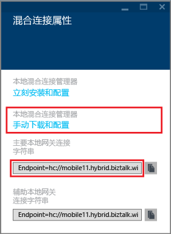
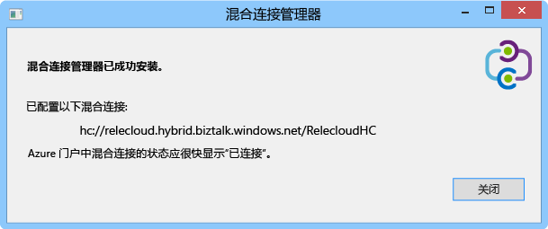
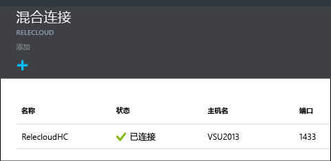

1. 在“混合连接”边栏选项卡中，单击刚创建的混合连接，然后单击“侦听器安装”。
   
    
2. 将打开“混合连接属性”边栏选项卡。 在“本地混合连接管理器”下，选择“下载并手动配置”，保存已下载的 HybridConnectionManager.msi 包，然后复制网关连接字符串。
   
    
3. 在管理员命令提示符中，键入以下命令以启动安装程序：
   
        start HybridConnectionManager.msi
4. 安装程序运行后，单击“现在不”，然后浏览到 %ProgramFiles%\Microsoft\HybridConnectionManager 文件夹，运行 HCMConfigWizard.exe，然后在“用户帐户控制”对话框中单击“是”。
5. 粘贴先前复制的混合连接字符串，然后单击“确定”。 
   
    
6. 安装完成后，单击“关闭”。
   
    
   
    在“混合连接”边栏选项卡上，“状态”列现在显示“已连接”。 
   
    

<!--HONumber=Nov16_HO3-->

