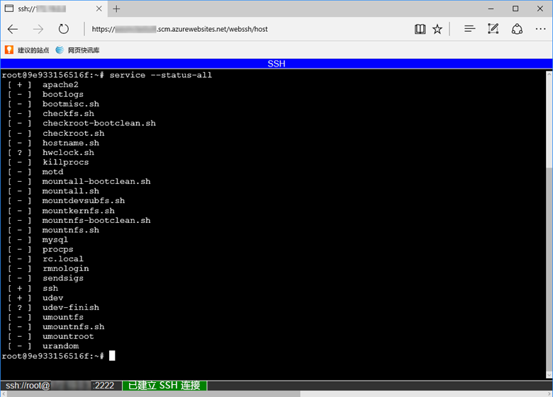

若要通过容器打开直接的 SSH 会话，应用应该处于正在运行状态。

将以下 URL 粘贴到浏览器中，将 \<app-name> 替换为应用名称：

```
https://<app-name>.scm.azurewebsites.net/webssh/host
```

如果尚未进行身份验证，则需通过要连接的 Azure 订阅进行身份验证。 完成身份验证以后，可以看到一个浏览器内 shell，可以在其中的容器中运行命令。


