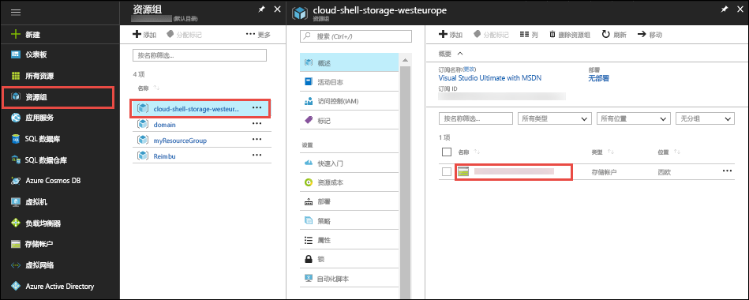

在 [Azure 门户](https://portal.azure.com)中，单击“资源组” > **cloud-shell-storage-\<your_region>** > **\<storage_account_name>**。



在存储帐户的“概览”页中，选择“文件”。

选择自动生成的文件共享，然后选择“上传”。 此文件共享在 Cloud Shell 中装载为 `clouddrive`。


单击文件选择器并选择 ZIP 文件，然后单击“上传”。 

在 Cloud Shell 中，使用 `ls` 来验证是否可以在默认的 `clouddrive` 共享中看到上传的 ZIP 文件。

```azurecli-interactive
ls clouddrive
```
