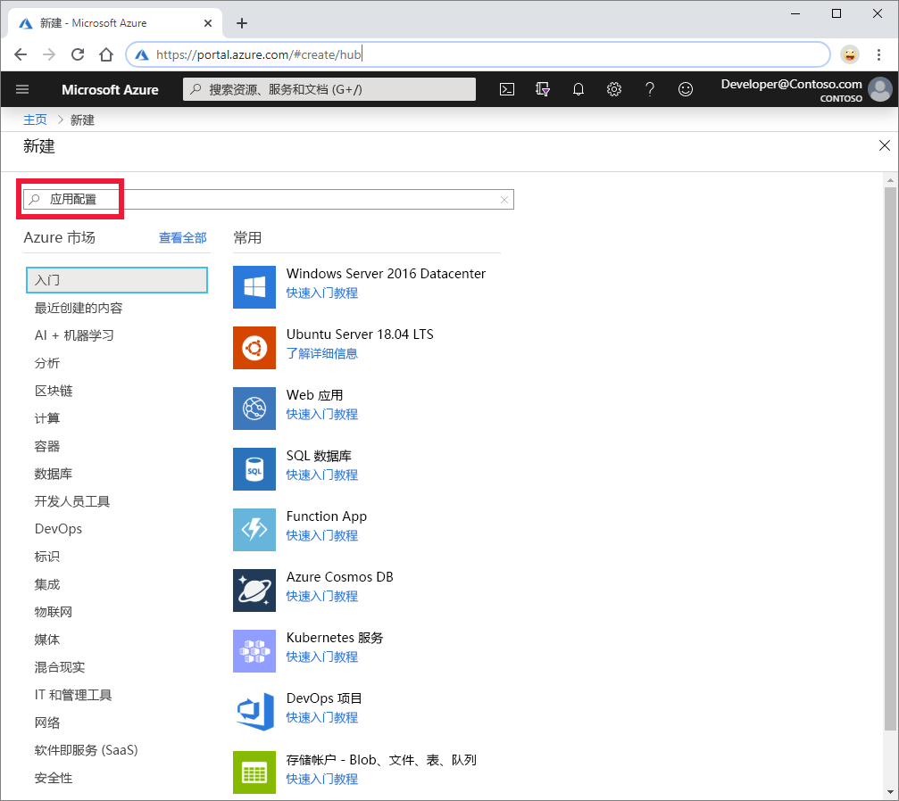
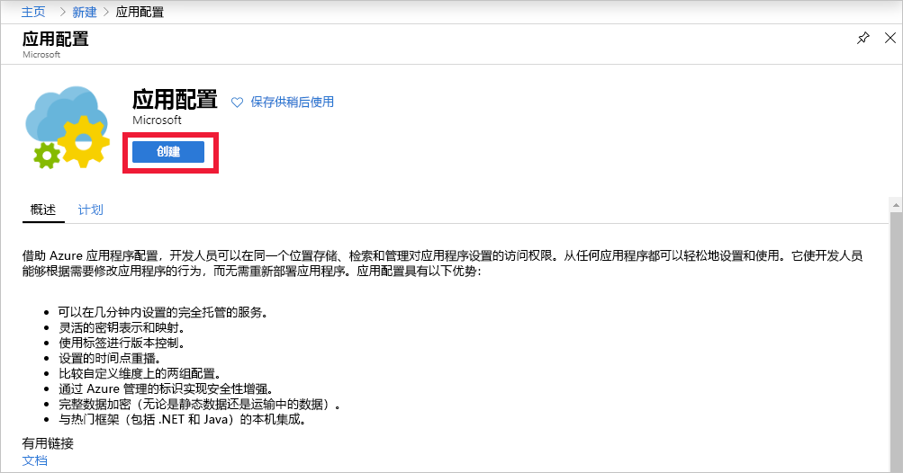
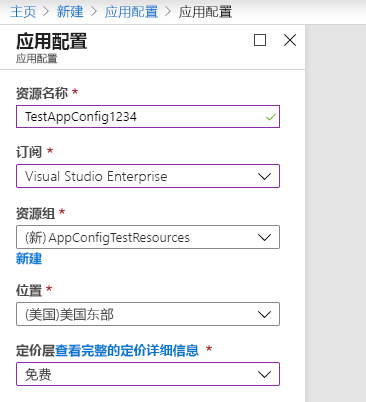

1. 若要创建新应用程序配置存储区，请登录 [Azure 门户](https://portal.azure.com)。 在主页的左上角，选择“创建资源”  。 在“搜索市场”框中，输入“应用程序配置”并选择 Enter   。

    

1. 在搜索结果中选择“应用程序配置”，然后选择“创建”   。

    

1. 在“应用程序配置” > “创建”窗格中，输入以下设置：

    | 设置 | 建议的值 | 说明 |
    |---|---|---|
    | **资源名称** | 全局唯一名称 | 输入要用于应用程序配置存储区资源的唯一资源名称。 该名称必须是包含 5 到 50 个字符的字符串，只能包含数字、字母和 `-` 字符。 该名称的开头或末尾不能是 `-` 字符。  |
    | **订阅** | 订阅 | 选择要用来测试应用配置的 Azure 订阅。 如果帐户只有一个订阅，则会自动选择该订阅并且不显示“订阅”列表  。 |
    | **资源组** | AppConfigTestResources  | 为应用程序配置存储区资源选择或创建资源组。 此组可用于组织多个资源，删除该资源组可以同时删除这些资源。 有关详细信息，请参阅[使用资源组管理 Azure 资源](/azure/azure-resource-manager/resource-group-overview)。 |
    | **位置** | 美国中部  | 使用“位置”指定在其中托管应用配置存储区的地理位置  。 为获得最佳性能，请在应用程序的其他组件所在的同一区域创建资源。 |
    | **定价层** | *免费* | 选择所需的定价层。 有关更多详细信息，请参阅[应用配置定价页](https://azure.microsoft.com/pricing/details/app-configuration/)。

    

1. 选择“创建”  。 部署可能需要几分钟。

1. 部署完成后，选择“设置” > “访问密钥”。 记下只读主密钥连接字符串。 稍后将使用此连接字符串来配置应用程序，以与创建的应用程序配置存储区进行通信。
