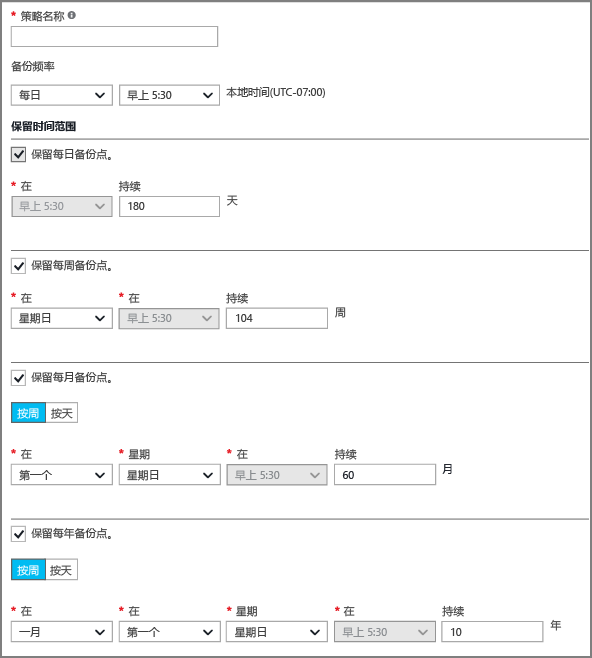
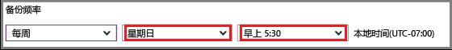

## 定义备份策略
备份策略定义以及制作数据快照时，这些快照将保留多长时间的矩阵。 在定义备份 VM 的策略时，可以触发备份作业*每天一次*。 如果创建新策略时，它会应用到保管库。 备份策略接口如下所示：

若要创建的策略：

1. 输入的名称**策略名称**。
2. 可以按每天或每周的时间间隔拍摄的你的数据的快照。 使用**备份频率**下拉菜单中选择是否数据快照会每天或每周。
   
   * 如果你选择每日的时间间隔，使用突出显示的控件选择快照的一天的时间。 若要更改小时，取消选中了小时，并选择新的小时。
     
       
   * 如果你选择每周的时间间隔，用于突出显示的控件选择一周中的天和一天以拍摄快照的时间。 在天菜单中，选择一个或多个天数。 在小时菜单中，选择一小时。 若要更改小时，取消选择了所选的小时，并选择新的小时。
     
     
3. 默认情况下，所有**保持期**会选择的选项。 取消选中不想要使用任何保留范围限制。 然后，指定要使用 interval(s)。
   
    每月和每年保留范围，可以指定基于每周或每日增量快照。
   
   > [!NOTE]
   > 当保护虚拟机，备份作业将运行一天一次。 该备份运行时的时间是为每个保留范围相同。
   > 
   > 
4. 设置策略的所有选项之后, 在边栏选项卡的顶部单击**保存**。
   
    新的策略将立即应用到保管库中。

