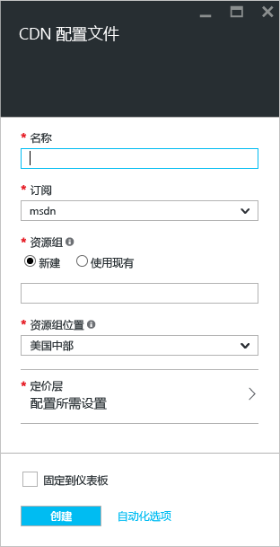
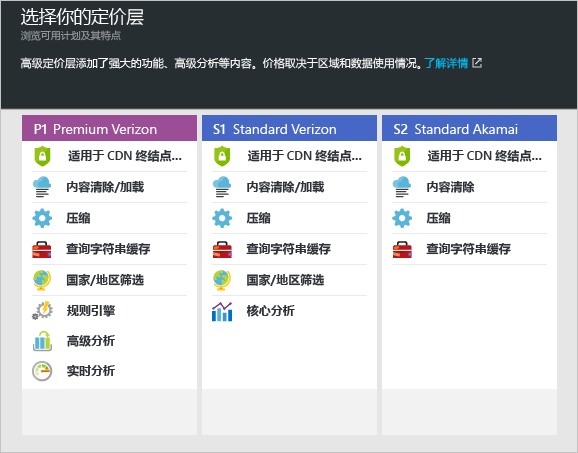

**创建新的 CDN 配置文件**

1. 在 [Azure 门户](https://portal.azure.com)的左上角，选择“创建资源”。
    
2. 在“新建”边栏选项卡中，选择“Web + 移动”，并选择“CDN”。
   
    此时将显示“CDN 配置文件”边栏选项卡。
   
    
3. 对于**名称**，输入 CDN 配置文件的唯一名称。
    
4. 对于**订阅**，选择要用于此 CDN 配置文件的订阅。
   
5. 对于**资源组**，选择或创建资源组。 有关资源组的信息，请参阅 [Azure 资源管理器概述](../articles/azure-resource-manager/resource-group-overview.md#resource-groups)。
    
6. 对于**资源组位置**，选择用于存储 CDN 配置文件信息的 Azure 位置。 此位置不会影响 CDN 终结点位置。
    
7. 对于**定价层**，选择定价层。 如需比较每个定价层提供的功能，请参阅 [Azure CDN 功能](../articles/cdn/cdn-overview.md#azure-cdn-features)。
   
    

8. （可选）选择“立即新建 CDN 终结点”以显示用于在创建配置文件的同时创建终结点的选项。 有关详细信息，请参阅[新建 CDN 终结点](../articles/cdn/cdn-create-new-endpoint.md#create-a-new-cdn-endpoint)。
   
9. 如果希望在创建配置文件后将其保存到仪表板以便更便于查找，请选择“固定到仪表板”。
    
10. 选择“创建”以创建该配置文件。 

