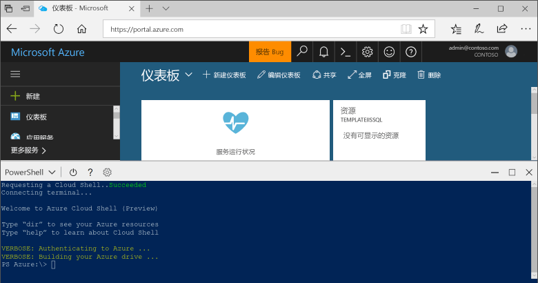

## 启动 Azure Cloud Shell

Azure Cloud Shell 是可直接在 Azure 门户中运行的免费 shell。 它预安装有常用 Azure 工具并将其配置与帐户一起使用。 单击 [Azure 门户](https://portal.azure.com)右上角菜单上的“Cloud Shell”按钮。

该按钮会启动交互式 shell，可以使用它运行本主题中的所有步骤：

