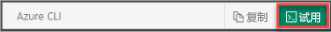

## 打开 Azure Cloud Shell

Azure Cloud Shell 是免费的交互式 shell，可以使用它运行本文中的步骤。 Cloud Shell 中预安装并配置了常用 Azure 工具供你与帐户一起使用。 只需选择“复制”按钮即可复制代码，将其粘贴到 Cloud Shell 中，然后按 Enter 来运行它。 可通过多种方式打开 Cloud Shell：

|  |   |
|-----------------------------------------------|---|
| 选择代码块右上角的“试用”。 |  |
| 在浏览器中打开 Cloud Shell。 |  |
| 选择 [Azure 门户](https://portal.azure.com)右上角菜单上的“Cloud Shell”按钮。 |     |
|  |  |

