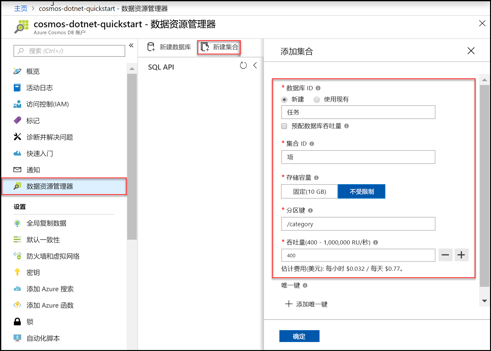

现在可以在 Azure 门户中使用数据资源管理器工具来创建数据库和容器。 

1. 单击“数据资源管理器” > “新建容器”。   
    
    “添加容器”区域显示在最右侧，可能需要向右滚动才能看到它。 

    

2. 在“添加容器”页中，输入新容器的设置。 

    |设置|建议的值|描述
    |---|---|---|
    |**数据库 ID**|任务|输入 *Tasks* 作为新数据库的名称。 数据库名称必须包含 1 到 255 个字符，不能包含 /、\\、#、? 或尾随空格。 选中“预配数据库吞吐量”选项，这样就可以在数据库中的所有容器之间共享预配给该数据库的吞吐量。  此选项还有助于节省成本。 |
    |**吞吐量**|400|将吞吐量保留为每秒 400 个请求单位 (RU/s)。 如果想要减少延迟，以后可以增加吞吐量。| 
    |**容器 ID**|项|输入 *Items* 作为新容器的名称。 容器 ID 与数据库名称的字符要求相同。|
    |**分区键**| /category| 本文中所述的示例使用 /category  作为分区键。 设置分区键使 Azure Cosmos DB 可以缩放集合，从而满足应用程序的存储和吞吐量需求。 通常，选择分区键时最好选择具有各种不同值的分区键，从而使存储和请求量均匀分布于工作负荷中。 [详细了解分区](../articles/cosmos-db/partitioning-overview.md)。|
    
    除了前面的设置，还可以选择为容器添加“唯一键”。  在此示例中，请将此字段留空。 开发人员可以使用唯一键向数据库添加一层数据完整性。 创建容器时，通过创建唯一键策略，可确保每个分区键的一个或多个值的唯一性。 若要了解详细信息，请参阅 [Azure Cosmos DB 中的唯一键](../articles/cosmos-db/unique-keys.md)一文。
    
    选择“确定”  。 数据资源管理器将显示新的数据库和容器。

