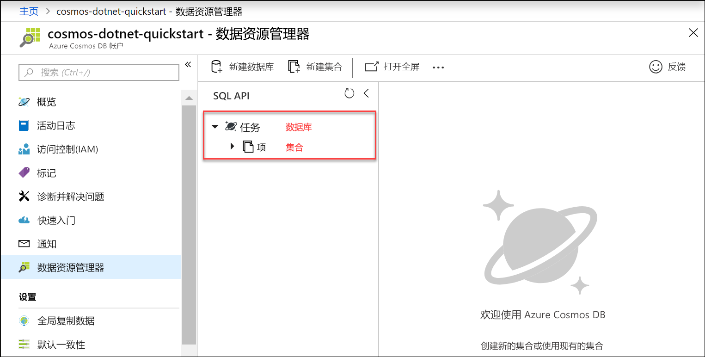

现在可以在 Azure 门户中使用数据资源管理器工具来创建数据库和集合。 

1. 单击“数据资源管理器” > “新建集合”。 
    
    “添加集合”区域显示在最右侧，可能需要向右滚动才能看到它。

    

2. 在“添加集合”页上，输入新集合的设置。

    设置|建议的值|Description
    ---|---|---
    数据库 ID|*任务*|输入 *Tasks* 作为新数据库的名称。 数据库名称必须包含 1 到 255 个字符，不能包含 /、\\、#、? 或尾随空格。
    集合 ID|*项*|输入 *Items* 作为新集合的名称。 集合 ID 与数据库名称的字符要求相同。
    预配数据库吞吐量|留空|Azure Cosmos DB 可以在数据库级别（数据库中的所有集合共享相同的吞吐量）或集合级别预配吞吐量。 留空可在此特定集合的集合级别上预配吞吐量。
    存储容量|*不受限制*|选择**无限**的存储容量。 
    分区键|*/category*|输入“/category”作为分区键。 设置分区键使 Azure Cosmos DB 可以缩放集合，从而满足应用程序的存储和吞吐量需求。 通常，选择分区键时最好选择具有各种不同值的分区键，从而使存储和请求量均匀分布于工作负荷中。 [详细了解分区](../articles/cosmos-db/partitioning-overview.md)。
    Throughput|*400 RU/秒*|将吞吐量更改为每秒 400 个请求单位 (RU/s)。 如果想要减少延迟，以后可以增加吞吐量。 
    
    除了前面的设置，还可以选择为集合添加“唯一键”。 在此示例中，请将此字段留空。 开发人员可以使用唯一键向数据库添加一层数据完整性。 创建集合时，通过创建唯一键策略，可确保每个分区键的一个或多个值的唯一性。 若要了解详细信息，请参阅 [Azure Cosmos DB 中的唯一键](../articles/cosmos-db/unique-keys.md)一文。
    
    单击“确定”。

    数据资源管理器将显示新的数据库和集合。

    