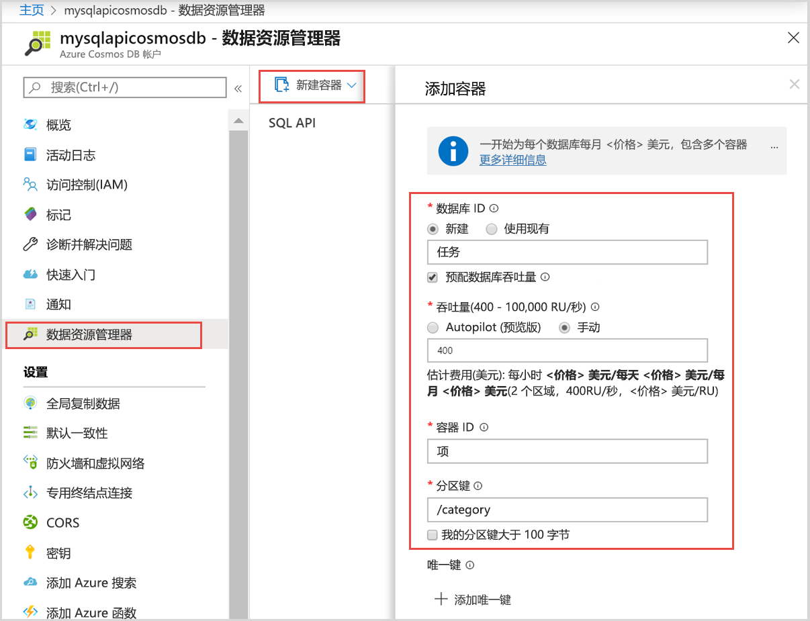

现在可以在 Azure 门户中使用数据资源管理器工具来创建数据库和集合。 

1. 在 Azure 门户的左侧导航菜单中，单击“数据资源管理器(预览版)”。 

2. 在“数据资源管理器(预览版)”边栏选项卡中，单击“新建集合”，然后提供以下信息：

    

    设置|建议的值|说明
    ---|---|---
    数据库 ID|任务|新数据库的名称。 数据库名称必须包含 1 到 255 个字符，不能包含 /、\\、#、? 或尾随空格。
    集合 ID|Items|新集合的名称。 集合名称与数据库 ID 的字符要求相同。
    存储容量| 固定 (10 GB)|使用默认值。 此值是数据库的存储容量。
    吞吐量|400 RU|使用默认值。 如果想要减少延迟，以后可以增加吞吐量。
    RU/m|关闭|保留默认值。
    分区键|/category|一个分区键，用于将数据均匀分配到每个分区。 选择正确的分区键对于创建高性能集合而言很重要。 若要了解详细信息，请参阅[设计分区](../articles/cosmos-db/partition-data.md#designing-for-partitioning)。    
3. 完成表单后，单击“确定”。

数据资源管理器显示新的数据库和集合。 