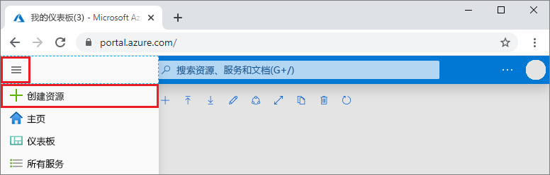
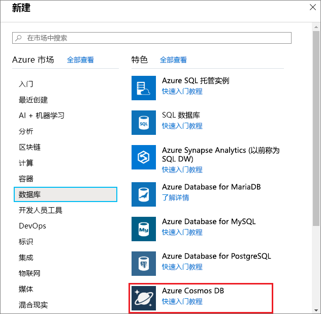
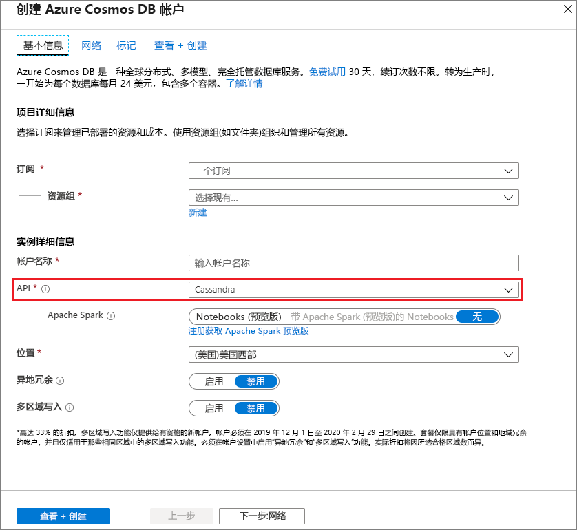

1. 在新浏览器窗口中，登录到 [Azure 门户](https://portal.azure.com/)。

2. 在左侧菜单中，选择“创建资源”  。
   
   
   
3. 在“新建”页上，选择“数据库” > “Azure Cosmos DB”。   
   
   
   
3. 在“创建 Azure Cosmos DB 帐户”页中，输入新 Azure Cosmos DB 帐户的设置  。 
 
    设置|值|说明
    ---|---|---
    订阅|订阅|选择要用于此 Azure Cosmos DB 帐户的 Azure 订阅。 
    资源组|新建  然后，输入与帐户名称相同的名称。|选择“新建”。  然后输入帐户的新资源组名称。 为简单起见，请使用与 Azure Cosmos 帐户名称相同的名称。 
    帐户名|输入唯一的名称|输入标识此 Azure Cosmos DB 帐户的唯一名称。 帐户 URI 将是追加到唯一帐户名称的“cassandra.cosmos.azure.com”  。  帐户名称只能使用小写字母、数字及连字符 (-)，必须为 3 到 31 个字符长。
    API|Cassandra|API 确定要创建的帐户的类型。 Azure Cosmos DB 提供五种 API：Core(SQL)（适用于文档数据库）、Gremlin（适用于图数据库）、MongoDB（适用于文档数据库）、Azure 表和 Cassandra。 必须为每种 API 创建单独的帐户。   选择“Cassandra”  ，因为本快速入门将创建使用 Cassandra API 的表。   [详细了解 Cassandra API](../articles/cosmos-db/cassandra-introduction.md)。|
    位置|选择离用户最近的区域|选择用于托管 Azure Cosmos DB 帐户的地理位置。 使用离用户最近的位置，使他们能够以最快的速度访问数据。

    选择“查看 + 创建”  。 可以跳过“网络”  和“标记”  部分。 

    

4. 创建帐户需要几分钟时间。 等待门户中显示“祝贺你!  已创建 Azure Cosmos DB 帐户”页。

