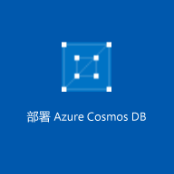

1. 在新浏览器窗口中，登录到 [Azure 门户](https://portal.azure.com/)。

2. 单击“新建” > “数据库” > “Azure Cosmos DB”。
   
   

3. 在“新建帐户”页上，输入新 Azure Cosmos DB 帐户的设置。 

    设置|建议的值|说明
    ---|---|---
    ID|*输入唯一名称*|输入标识此 Azure Cosmos DB 帐户的唯一名称。 由于 documents.azure.com 将追加到用户提供的 ID 用于创建 URI，因此，请使用唯一但可识别的 ID。  ID 只能包含小写字母、数字和连字符 (-) 字符，并且必须包含 3 到 50 个字符。
    API|Gremlin（图形）|API 确定要创建的帐户的类型。 Azure Cosmos DB 提供四种 API 以满足应用程序的需求：Gremlin（图形）、MongoDB、SQL (Cosmos DB) 和表（键/值），每个目前都需要单独的帐户。   之所以选择“Gremlin（图形）”是因为，在本快速入门中将创建一个可使用 Gremlin 语法查询的图形。  [详细了解图形 API](../articles/cosmos-db/graph-introduction.md)
    订阅|用户的订阅|选择要用于此 Azure Cosmos DB 帐户的 Azure 订阅。 
    资源组|*输入上面在 ID 中提供的同一唯一名称*|输入帐户的新资源组名称。 为简单起见，可以使用与 ID 相同的名称。 
    位置|*选择离用户最近的区域*|选择要在其中托管 Azure Cosmos DB 帐户的地理位置。 使用离用户最近的位置，使他们能够以最快的速度访问数据。
    启用异地冗余| 留空 | 这将在第二个（配对）区域中创建数据库的复制版本。 将此项留空。  
    固定到仪表板 | 选择 | 选中此框，以便将新的数据库帐户添加到门户仪表板以便于访问。

    然后单击“创建”。

    

4. 创建帐户需要几分钟时间。 在创建帐户过程中，门户会显示“部署 Azure Cosmos DB”磁贴。

    

    创建帐户后，会显示“祝贺你!已创建 Azure Cosmos DB 帐户”页。 