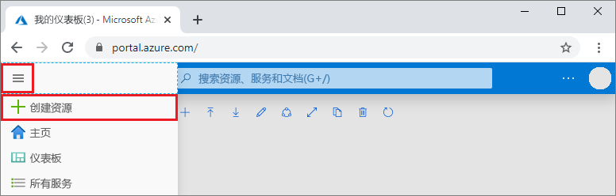

1. 在新浏览器窗口中，登录到 [Azure 门户](https://portal.azure.com/)。

2. 在左侧菜单中，选择“创建资源”  。
   
   
   
3. 在“新建”页上，选择“数据库” > “Azure Cosmos DB”。   
   
   
   
3. 在“创建 Azure Cosmos DB 帐户”页中，输入新 Azure Cosmos DB 帐户的设置  。 
 
    设置|值|说明
    ---|---|---
    订阅|订阅|选择要用于此 Azure Cosmos DB 帐户的 Azure 订阅。 
    资源组|新建  然后，输入与帐户名称相同的名称。|选择“新建”。  然后输入帐户的新资源组名称。 为简单起见，请使用与 Azure Cosmos DB 帐户名称相同的名称。 
    帐户名|输入唯一的名称|输入标识此 Azure Cosmos DB 帐户的唯一名称。 帐户 URI 将是追加到唯一帐户名称的 *mongo.cosmos.azure.com*。  帐户名称只能使用小写字母、数字及连字符 (-)，必须为 3 到 31 个字符长。
    API|Azure Cosmos DB for Mongo DB API|API 确定要创建的帐户的类型。 Azure Cosmos DB 提供五种 API：适用于文档数据库的 Core (SQL)、适用于图形数据库的 Gremlin、适用于文档数据库的 Azure Cosmos DB for Mongo DB API、Azure 表和 Cassandra。 目前，你必须为每种 API 创建单独的帐户。   选择“Azure Cosmos DB for Mongo DB API”，因为本快速入门将创建使用 MongoDB 的集合  。  [了解有关 Azure Cosmos DB for MongoDB API 的详细信息](../articles/cosmos-db/mongodb-introduction.md)。|
    位置|选择离用户最近的区域|选择用于托管 Azure Cosmos DB 帐户的地理位置。 使用离用户最近的位置，使他们能够以最快的速度访问数据。|

    选择“查看 + 创建”  。 可以跳过“网络”  和“标记”  部分。 

    

4. 创建帐户需要几分钟时间。 等待门户中显示“祝贺你!  Azure Cosmos DB for MongoDB 帐户已准备就绪”页。

    
