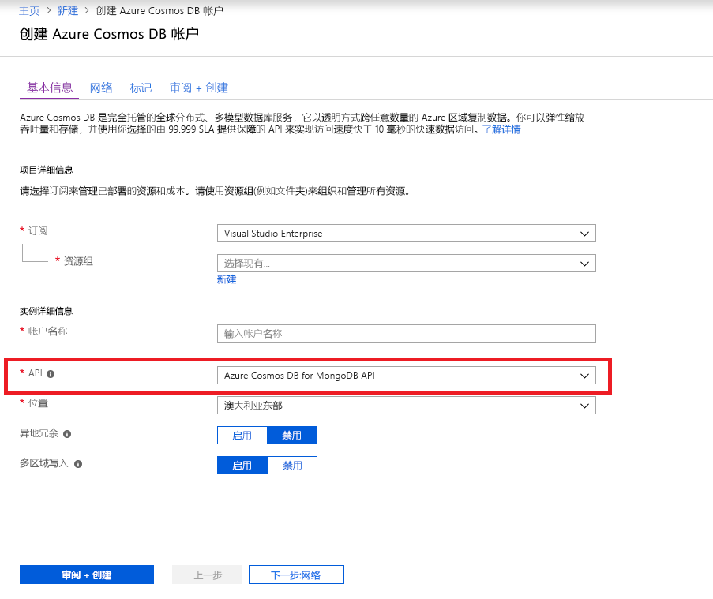
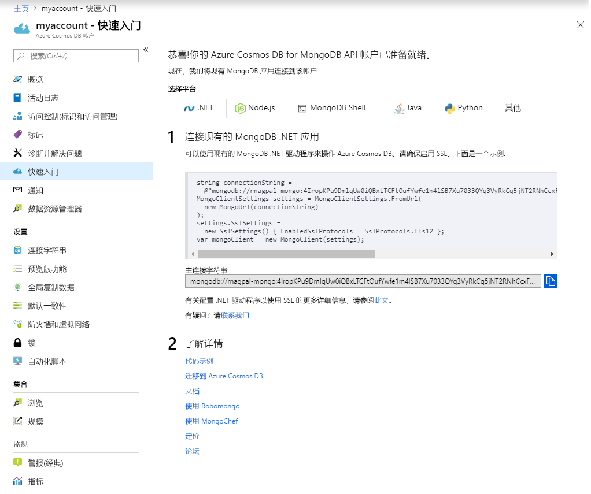

1. 在新窗口中，登录到 [Azure 门户](https://portal.azure.com/)。
2. 在左菜单中，依次单击“创建资源”、“数据库”，然后在“Azure Cosmos DB”下单击“创建”。
   
   

3. 在“新建帐户”边栏选项卡中，指定“MongoDB”作为 API，并填充 Azure Cosmos DB 帐户所需的配置。
 
    * “ID”必须是用于标识 Azure Cosmos DB 帐户的唯一名称。 ID 只能包含小写字母、数字和“-”字符，且长度必须为 3 到 50 个字符。
    * “订阅”是你的 Azure 订阅。 系统会自动填充此值。
    * “资源组”是 Azure Cosmos DB 帐户的资源组名称。 选择“新建”，然后输入帐户的新资源组名称。 为简单起见，可以使用与 ID 相同的名称。
    * “位置”是 Azure Cosmos DB 实例所在的地理位置。 请选择最靠近用户的位置。

    然后单击“创建”。

    

4. 创建帐户需要几分钟时间。 等待门户中显示“祝贺你!**使用 MongoDB API 的 Azure Cosmos DB 帐户已准备就绪”** 页。

    
