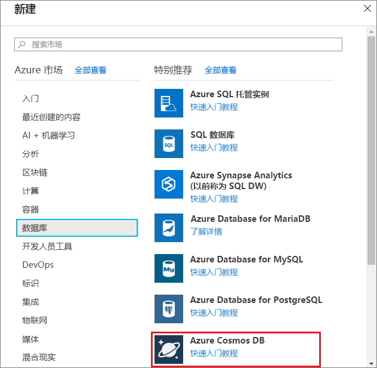
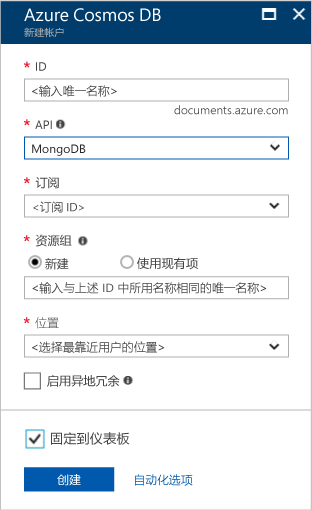
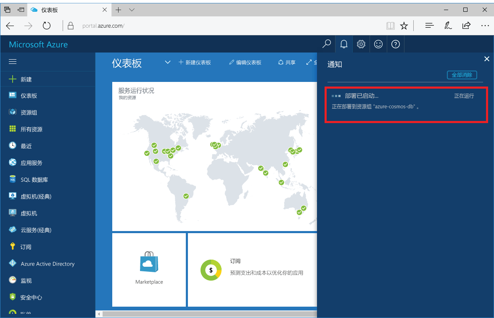
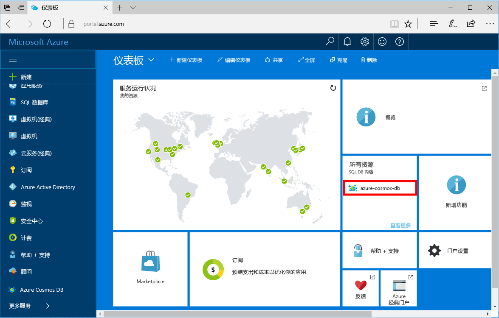

1. 在新窗口中，登录到 [Azure 门户](https://portal.azure.com/)。
2. 在左菜单中，依次单击“新建”、“数据库”，然后在“Azure Cosmos DB”下单击“创建”。
   
   

3. 在“新建帐户”边栏选项卡中，为 Azure Cosmos DB 帐户指定所需的配置。 

    使用 Azure Cosmos DB，可以选择以下四个编程模型之一：Gremlin（图形）、MongoDB、SQL (DocumentDB) 和表（键/值）。 
       
    在本快速入门教程中，我们将针对 MongoDB API 编程，因此，在填写表单时，请选择“MongoDB”。 但如果有社交媒体应用的图形数据、来自目录应用的文档数据或键/值（表）数据，请意识到 Azure Cosmos DB 可以为所有任务关键型应用程序提供高度可用的全球分布式数据库服务平台。

    以表中的信息作为指南，填写“新建帐户”边栏选项卡。
 
    
   
    设置|建议的值|说明
    ---|---|---
    ID|*唯一值*|选择用于标识 Azure Cosmos DB 帐户的唯一名称。 *documents.azure.com* 将追加到提供的 ID 以创建 URI，因此，请使用唯一但可识别的 ID。 该 ID 只能包含小写字母、数字及“-”字符，且长度必须为 3 到 50 个字符。
    API|MongoDB|API 确定要创建的帐户的类型。 Azure Cosmos DB 提供了五种 API，用以满足应用程序的需求：SQL（文档数据库）、Gremlin（图形数据库）、MongoDB（文档数据库）、Azure 表和 Cassandra，每个目前都需要单独的帐户。   之所以选择 **MongoDB**，是因为在本快速入门中将创建可使用 MongoDB 查询的文档数据库。  [详细了解 MongoDB API](../articles/cosmos-db/mongodb-introduction.md)|
    订阅|用户的订阅|要用于 Azure Cosmos DB 帐户的 Azure 订阅。 
    资源组|*与 ID 相同的值*|帐户的新资源组名称。 为简单起见，可以使用与 ID 相同的名称。 
    位置|*离用户最近的区域*|要在其中托管 Azure Cosmos DB 帐户的地理位置。 选择离用户最近的位置，使其能够以最快的速度访问数据。

4. 单击“创建”  以创建帐户。
5. 在工具栏上，单击“通知”可监视部署过程。

    

6.  部署完成后，请从“所有资源”磁贴打开新帐户。 

    
