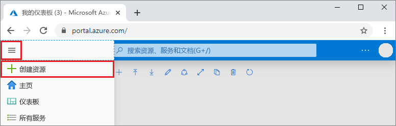
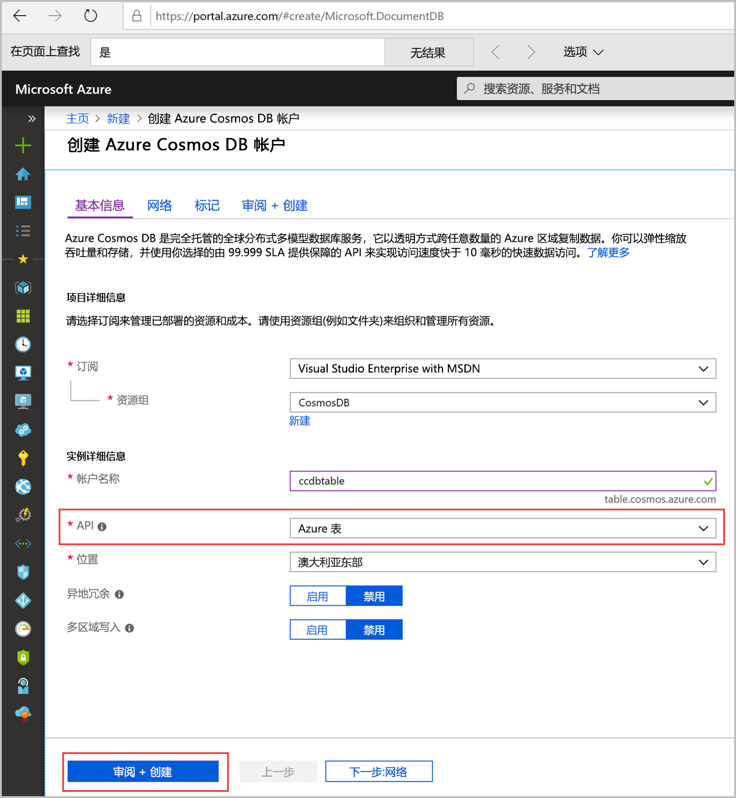
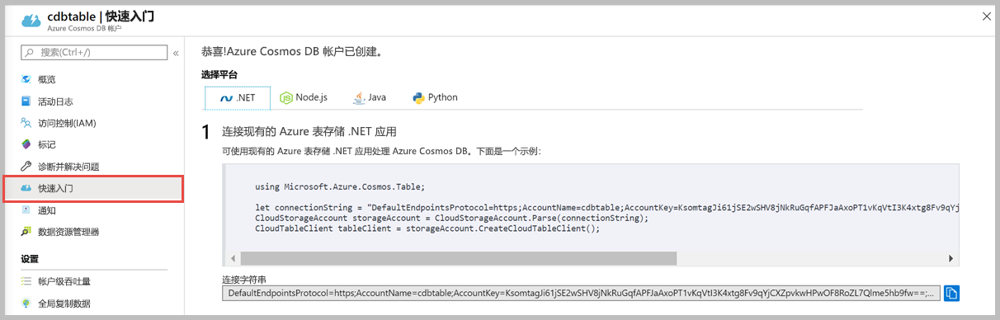

1. 在新浏览器窗口中，登录到 [Azure 门户](https://portal.azure.com/)。

2. 在左侧菜单中，选择“创建资源”  。
   
   
   
3. 在“新建”页上，选择“数据库” > “Azure Cosmos DB”。   
   
   
   
3. 在“创建 Azure Cosmos DB 帐户”页中，输入新 Azure Cosmos DB 帐户的设置  。 
 
    设置|值|说明
    ---|---|---
    订阅|订阅|选择要用于此 Azure Cosmos DB 帐户的 Azure 订阅。 
    资源组|选择“新建”  ，然后选择“帐户名称”|选择“新建”。  然后输入帐户的新资源组名称。 为简单起见，请使用与 Azure Cosmos DB 帐户名称相同的名称。 
    帐户名|唯一的名称|输入标识此 Azure Cosmos DB 帐户的唯一名称。  帐户名称只能使用小写字母、数字及连字符 (-)，必须为 3 到 31 个字符长。
    API|表|API 确定要创建的帐户的类型。 Azure Cosmos DB 提供五种 API：Core(SQL)（适用于文档数据库）、Gremlin（适用于图数据库）、MongoDB（适用于文档数据库）、Azure 表和 Cassandra。 必须为每种 API 创建单独的帐户。   选择“Azure 表”  ，因为在本快速入门中，将创建一个使用表 API 的表。   [详细了解表 API](../articles/cosmos-db/table-introduction.md)。|
    位置|离用户最近的区域|选择用于托管 Azure Cosmos DB 帐户的地理位置。 使用离用户最近的位置，使他们能够以最快的速度访问数据。

    可以将“异地冗余”和“多区域写入”选项保留为“禁用”，避免产生额外的费用，并跳过“网络”和“标记”部分    。  

5. 选择“查看 + 创建”  。 完成验证后，选择“创建”以创建帐户  。 
 
   

6. 创建帐户需要几分钟时间。 你将看到一条说明“部署正在进行”的消息  。 等待部署完成，然后选择“转到资源”  。

    

