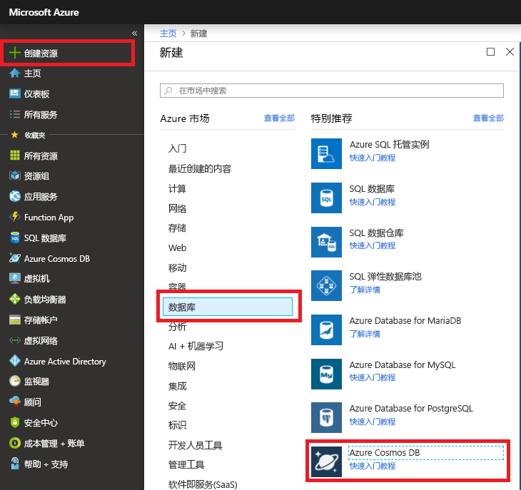
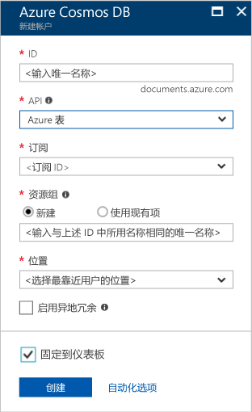

1. 在新浏览器窗口中，登录到 [Azure 门户](https://portal.azure.com/)。
2. 在左菜单中，依次单击“新建”、“数据库”，然后在“Azure Cosmos DB”下单击“创建”。 
   
   

3. 在“新建帐户”页上，输入新 Azure Cosmos DB 帐户的设置。 
 
    设置|建议的值|说明
    ---|---|---
    ID|*输入唯一名称*|输入标识此 Azure Cosmos DB 帐户的唯一名称。 由于 documents.azure.com 将追加到用户提供的 ID 用于创建 URI，因此，请使用唯一但可识别的 ID。  ID 只能包含小写字母、数字和连字符 (-) 字符，并且必须包含 3 到 50 个字符。
    API|Azure 表|API 确定要创建的帐户的类型。 Azure Cosmos DB 提供五种 API 以满足应用程序的需求：SQL（文档数据库）、Gremlin（图形数据库）、MongoDB（文档数据库）、Azure 表和 Cassandra，每个目前都需要单独的帐户。  选择“Azure 表”，因为在本快速入门中，将创建一个使用表 API 的表。  [详细了解表 API](../articles/cosmos-db/table-introduction.md) |
    订阅|*输入上面在 ID 中提供的同一唯一名称*|选择要用于此 Azure Cosmos DB 帐户的 Azure 订阅。 
    资源组|*与 ID 相同的值*|输入帐户的新资源组名称。 为简单起见，可以使用与 ID 相同的名称。 
    位置|*选择离用户最近的区域*|选择要在其中托管 Azure Cosmos DB 帐户的地理位置。 使用离用户最近的位置，使他们能够以最快的速度访问数据。
    启用异地冗余| 留空 | 这将在第二个（配对）区域中创建数据库的复制版本。 将此项留空。  
    固定到仪表板 | 选择 | 选中此框，以便将新的数据库帐户添加到门户仪表板以便于访问。

    然后单击“创建”。  

    

4. 创建帐户需要几分钟时间。 在创建帐户过程中，门户会显示“部署 Azure Cosmos DB”磁贴。

    

    创建帐户后，会显示“祝贺你!已创建 Azure Cosmos DB 帐户”页。
