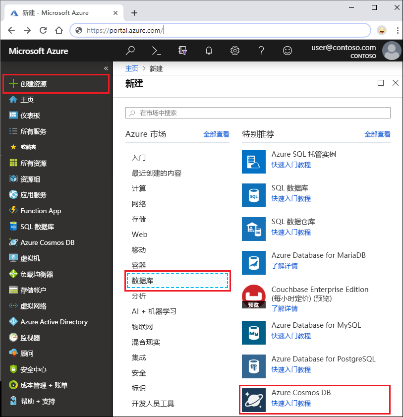
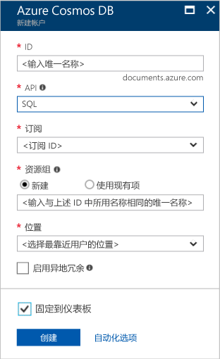

1. 在新窗口中，登录到 [Azure 门户](https://portal.azure.com/)。
2. 在左侧窗格中，依次单击“新建”、“数据库”，然后在“Azure Cosmos DB”下单击“创建”。
   
   

3. 在“新建帐户”边栏选项卡中，为此 Azure Cosmos DB 帐户指定所需配置。 

    使用 Azure Cosmos DB，可以选择以下四个编程模型之一：Gremlin（图形）、MongoDB、SQL (DocumentDB) 和表（键/值），每个目前都需要单独的帐户。
    
    在本快速入门文章中，我们针对 DocumentDB API 进行编程，因此填写表单时，请选择“SQL(DocumentDB)”。 如果有社交媒体应用的图形数据、键/值（表）数据或从 MongoDB 应用迁移的数据，则需意识到 Azure Cosmos DB 可以为所有任务关键型应用程序提供高度可用的全局分布式数据库服务平台。

    根据以下屏幕截图中的信息，完成“新建帐户”边栏选项卡上的各字段 - 你的值可能不同于屏幕截图中的值。
 
    

    设置|建议的值|说明
    ---|---|---
    ID|*唯一值*|标识此 Azure Cosmos DB 帐户的唯一名称。 由于 documents.azure.com 将追加到用户提供的 ID 用于创建 URI，因此，请使用唯一但可识别的 ID。 ID 只能包含小写字母、数字和连字符 (-) 字符，并且必须包含 3 到 50 个字符。
    API|SQL (DocumentDB)|在本文的后面部分中，我们将针对 [DocumentDB API](../articles/cosmos-db/documentdb-introduction.md) 编程。|
    订阅|用户的订阅|要用于此 Azure Cosmos DB 帐户的 Azure 订阅。 
    资源组|*与 ID 相同的值*|帐户的新资源组名称。 为简单起见，可以使用与 ID 相同的名称。 
    位置|
            *离用户最近的区域*|要在其中托管 Azure Cosmos DB 帐户的地理位置。 选择离用户最近的位置，使他们能够以最快的速度访问数据。
4. 单击“创建”  以创建帐户。
5. 在顶部工具栏上，单击“通知”图标可监视部署过程。

    

6.  当“通知”窗口指示部署成功后，请关闭通知窗口，然后从仪表板上的“所有资源”磁贴打开新帐户。 

    
 
