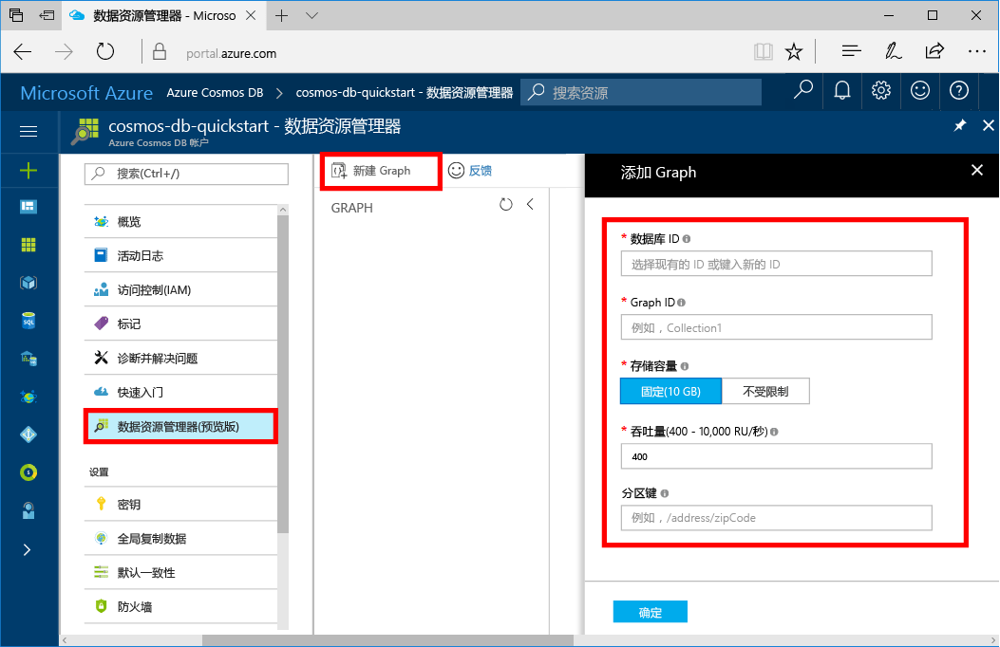

现在可以在 Azure 门户中使用数据资源管理器工具来创建图形数据库。 

1. 在 Azure 门户的左侧菜单中，选择“数据资源管理器(预览)”。

2. 在“数据资源管理器(预览)”下，选择“新建图”。 然后使用以下信息填写该页面：

    

    设置|建议的值|说明
    ---|---|---
    数据库 ID|sample-database|输入“sample-database”作为新数据库的名称。 数据库名称的长度必须为 1 到 255 个字符，不能包含 `/ \ # ?` 或尾随空格。
    图形 ID|sample-graph|输入“sample-graph”作为新集合的名称。 图形名称与数据库 ID 的字符要求相同。
    存储容量| 10 GB|保留默认值。 这是数据库的存储容量。
    吞吐量|400 RU|保留默认值。 如果想要减少延迟，以后可以增加吞吐量。

3. 填写表单后，请选择“确定”。
