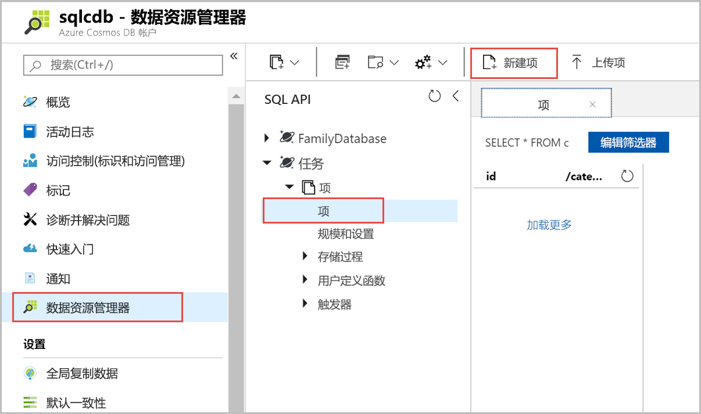
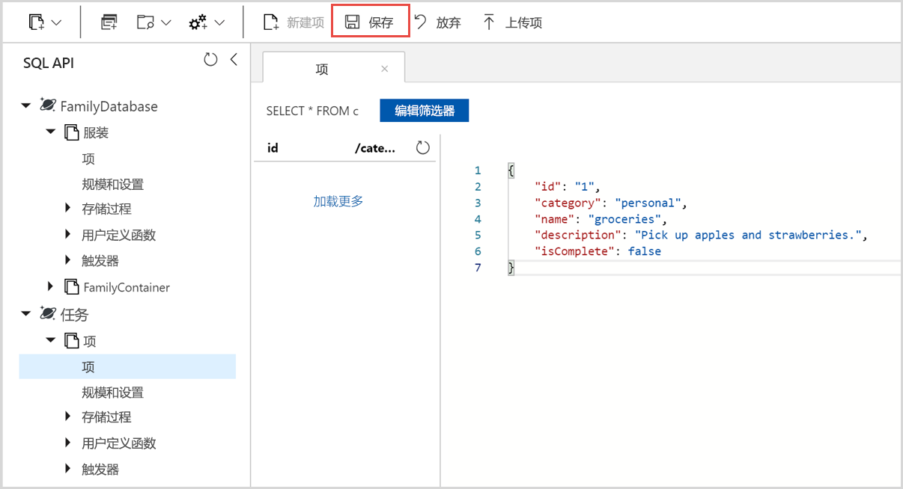

现在可以使用数据资源管理器将数据添加到新容器。

1. 在“数据资源管理器”中展开“Tasks”数据库，然后展开“Items”容器。    依次选择“项”、“新建项”。  

   
  
2. 现在，将文档添加到具有以下结构的容器。

     ```json
     {
         "id": "1",
         "category": "personal",
         "name": "groceries",
         "description": "Pick up apples and strawberries.",
         "isComplete": false
     }
     ```

3. 将 json 添加到“文档”选项卡以后，即可选择“保存”。  

    

4.  再创建并保存一个文档，在其中插入 `id` 属性的唯一值，并将其他属性更改为适当值。 新文档可以具有所需的任何结构，因为 Azure Cosmos DB 不对数据施加任何架构。