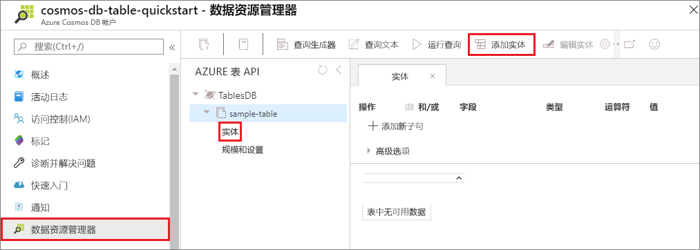
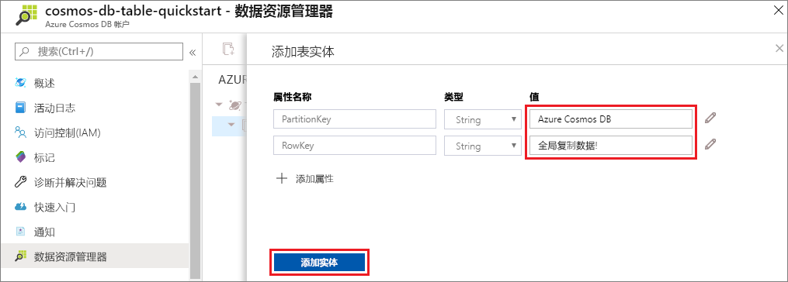

现在可以使用数据资源管理器将数据添加到新表。

1. 在数据资源管理器中，展开 **sample-table**，单击“实体”，然后单击“添加实体”。

   

2. 现在请将数据添加到 PartitionKey 值框和 RowKey 值框，然后单击“添加实体”。

   
  
    现在可以在数据资源管理器中将更多实体添加到表、编辑实体或查询数据。 使用数据资源管理器还可以缩放吞吐量，并将存储过程、用户定义的函数和触发器添加到表中。