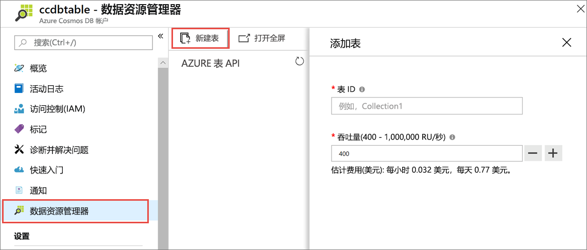
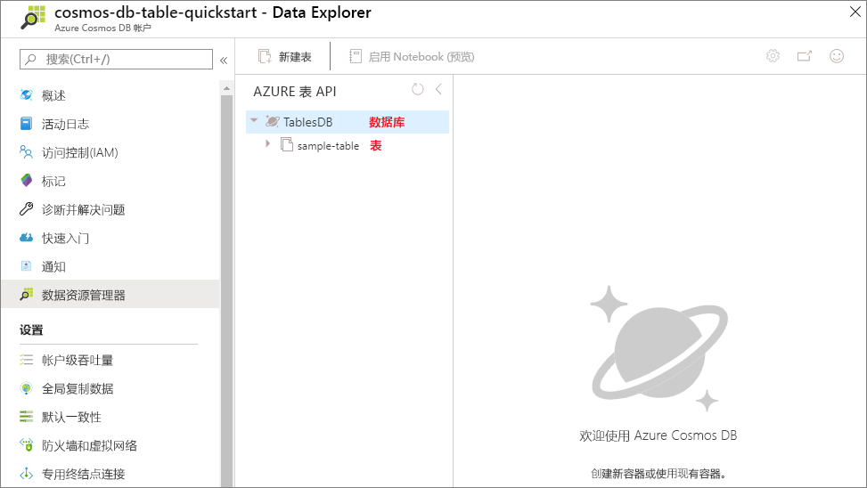

现在可以在 Azure 门户中使用数据资源管理器工具来创建数据库和表。 

1. 依次单击“数据资源管理器” > “新建表”。 
    
    此时，最右侧将显示“添加表”区域，可能需要向右滚动才能看到。

    

2. 在“添加表”页上，输入新表的设置。

    设置|建议的值|说明
    ---|---|---
    表 ID|sample-table|新表的 ID。 表名称与数据库 ID 的字符要求相同。 数据库名称的长度必须为 1 到 255 个字符，不能包含 `/ \ # ?` 或尾随空格。
    存储容量| 固定 (10 GB)|使用默认值“固定 (10 GB)”。 此值是数据库的存储容量。
    Throughput|400 RU|将吞吐量更改为每秒 400 个请求单位 (RU/s)。 如果想要减少延迟，以后可以增加吞吐量。

    单击“确定”。

    数据资源管理器将显示新的数据库和表。

    