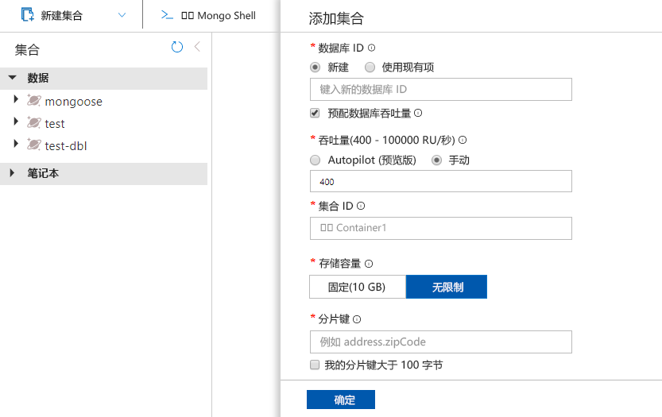

现在可以在 Azure 门户中使用数据资源管理器工具来创建用于 MongoDB 数据库和容器的 Azure Cosmos DB API。 

1. 选择“数据资源管理器” > “新建容器”。  
    
    “添加容器”区域显示在最右侧，可能需要向右滚动才能看到它。

    

2. 在“添加容器”页中，输入新容器的设置。

    |设置|建议的值|说明
    |---|---|---|
    |**数据库 ID**|db|输入“db”作为新数据库的名称。 数据库名称必须包含 1 到 255 个字符，不能包含 `/, \\, #, ?` 或尾随空格。 选中“预配数据库吞吐量”选项，这样就可以在数据库中的所有容器之间共享预配给该数据库的吞吐量。 此选项还有助于节省成本。 |
    |**吞吐量**|400|将吞吐量保留为每秒 400 个请求单位 (RU/s)。 如果想要减少延迟，以后可以增加吞吐量。 还可以选择 [Autoscale 模式](https://docs.microsoft.com/azure/cosmos-db/provision-throughput-autoscale)，该模式提供一定范围的 RU/s，可根据需要动态增加和减少。| 
    |**集合 ID**|coll|输入 `coll` 作为新容器的名称。 容器 ID 与数据库名称的字符要求相同。|
    |**存储容量**|固定(10GB)|为此应用程序输入“固定(10GB)”。 如果选择“无限制”，则需要创建一个 `Shard Key`，这是插入所有项时所需的。|
    |**分片键**| /_id| 本文中所述的示例不使用分片键，因此如果将其设置为 /_id，就会使用自动生成的 ID 字段作为分片键。 请参阅 [Azure Cosmos DB 中的分片](https://docs.microsoft.com/azure/cosmos-db/partitioning-overview)，了解关于分片（也被称为分区）的详细信息|
        
    选择“确定”。 数据资源管理器将显示新的数据库和容器。
