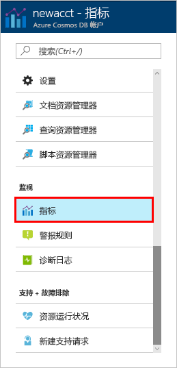
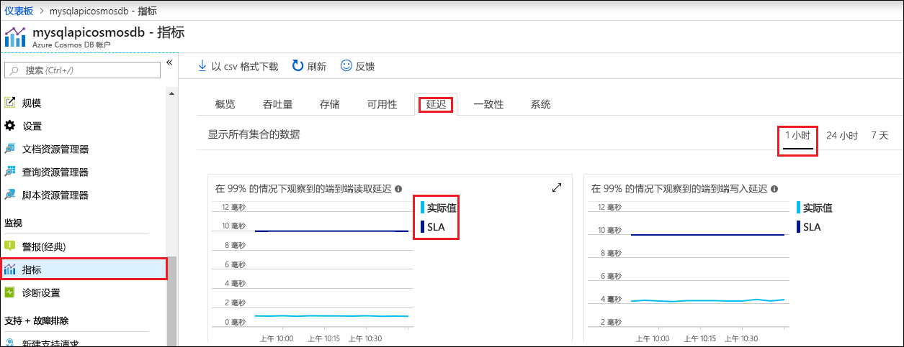

在 Azure 门户中监视帐户中资源的吞吐量、存储空间、可用性、延迟和一致性。 让我们快速了解一下这些指标。 

1. 在导航菜单中单击“指标”。

   

2. 单击每个选项卡，以便了解 Azure Cosmos DB 提供的指标。 

    与 [Azure Cosmos DB 服务级别协议 (SLA)](https://azure.microsoft.com/support/legal/sla/cosmos-db/) 关联的每个图表都提供了一行，显示是否违反了任何 SLA。 Azure Cosmos DB 通过此套指标使监视 SLA 的操作更透明。 

   