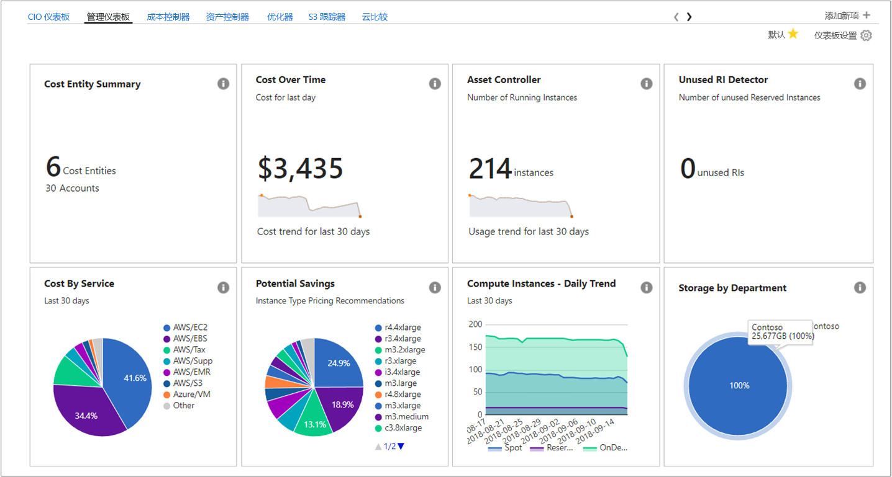
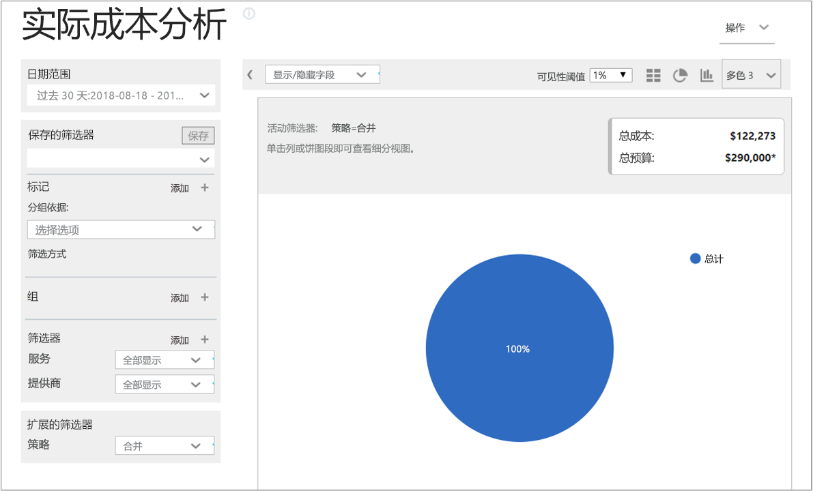
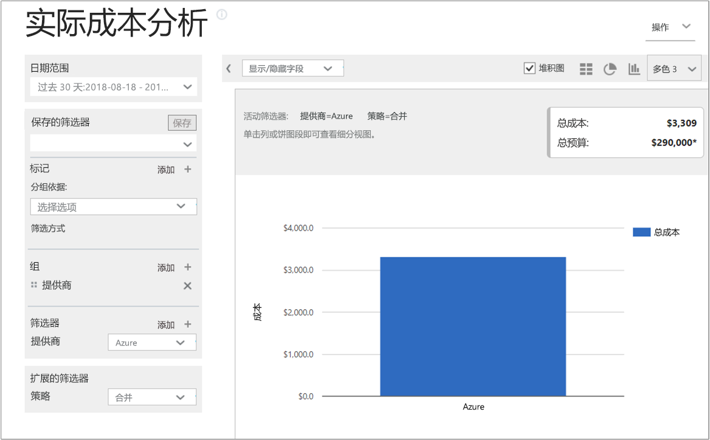
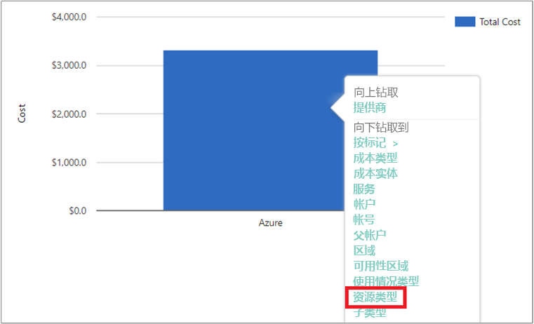
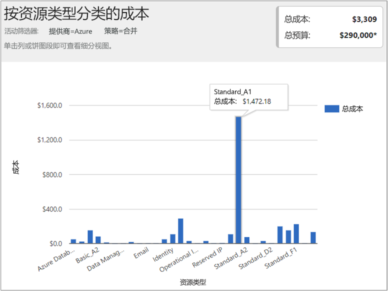
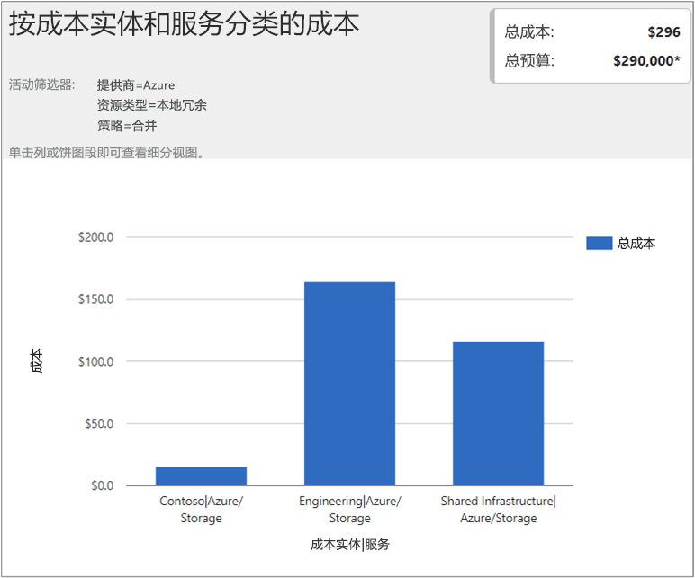

## 查看成本数据

使用 Cloudyn 提供的 Azure 成本管理可以访问所有云资源数据。 通过仪表板报表，可以在选项卡视图中查找标准报表和自定义报表。 下面是热门仪表板的示例，以及一份直接显示成本数据的报表。

在此示例中，“管理”仪表板显示了 Contoso 公司所有云资源的合并业务成本。 Contoso 使用 Azure、AWS 和 Google。 仪表板提供概览信息，是在报表中导航的便捷方式。  

如果不确定仪表板中报表的用途，将鼠标悬停在 **i** 符号上即可查看说明。 单击仪表板中的任一报表可查看完整报表。

也可以使用门户顶部的报表菜单查看报表。 让我们看看 Contoso 在过去 30 天的 Azure 资源开支。 单击“成本” > “成本分析” > “实际成本分析”。 如果在报表中为标记、组或筛选器设置了任何组，请清除这些值。

在本示例中，$75,970 是总成本，预算为 $130000。

现在，让我们修改报表格式，并设置组和筛选器来缩小 Azure 成本的结果范围。 将“日期范围”设置为过去 30 天。 在右上角，单击列符号以设置条形图格式，并在“组”下面选择“提供程序”。 然后，将“提供程序”的某个筛选器设置为“Azure”。

在本示例中，过去 30 天的 Azure 资源总成本为 $3,839。

右键单击“提供程序(Azure)”栏并向下钻取到“资源类型”。

下图显示了 Contoso 产生的 Azure 资源成本。 总计为 $3,839。 在本示例中，大约一半的成本花费在本地冗余存储上，另外大约一半的成本花费在各种 VM 实例上。

右键单击某个资源类型并选择“成本实体”，查看消耗了资源的成本实体和服务。 在本示例中，DevOps 中的 VM 和辅助角色服务消耗了 $486.60 和 $435.71。 两者的消耗成本总计为 $922。

若要观看有关查看云计费数据的教程视频，请参阅[使用 Cloudyn 提供的 Azure 成本管理分析云计费数据](https://youtu.be/G0pvI3iLH-Y)。
