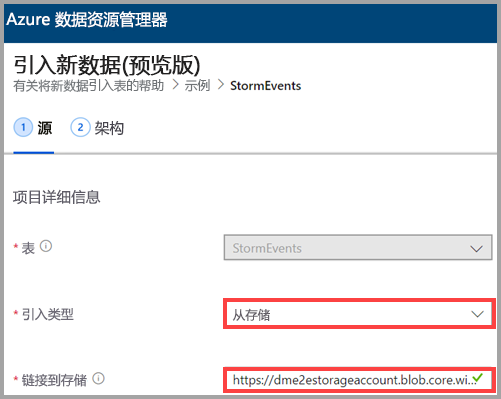
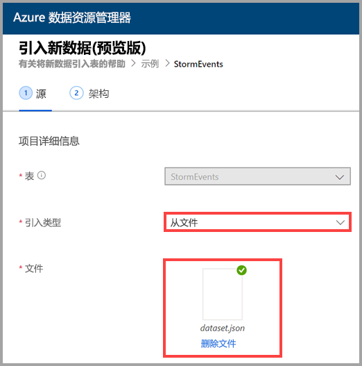
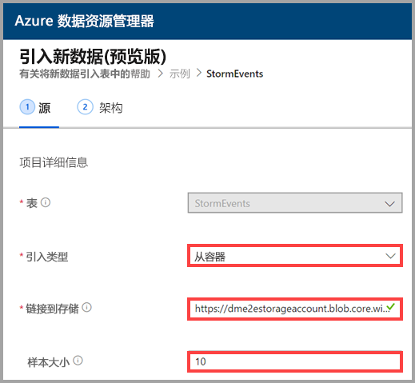
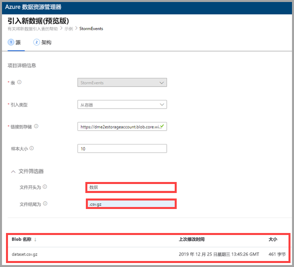

## 选择引入类型

对于“引入类型”，请选择以下选项之一： 
   * **从存储** - 在“链接到存储”字段中，添加存储帐户的 URL。  使用专用存储帐户的 [Blob SAS URL](/azurevs-azure-tools-storage-explorer-blobs#get-the-sas-for-a-blob-container)。
   
      

    * **从文件** - 选择“浏览”以找到文件，或者将文件拖放到字段中。 
  
      

    * **从容器** - 在“链接到存储”字段中，添加容器的 [SAS URL](/azure/vs-azure-tools-storage-explorer-blobs#get-the-sas-for-a-blob-container)，并选择性地输入样本大小。 

      

  此时会显示数据样本。 如果需要，可以筛选数据，仅显示以特定字符开头或结尾的文件。 调整筛选器时，预览会自动更新。
  
  例如，可以筛选以单词 data 开头、以扩展名 .csv.gz 结尾的所有文件。  

  
