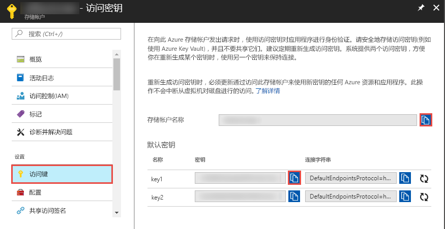
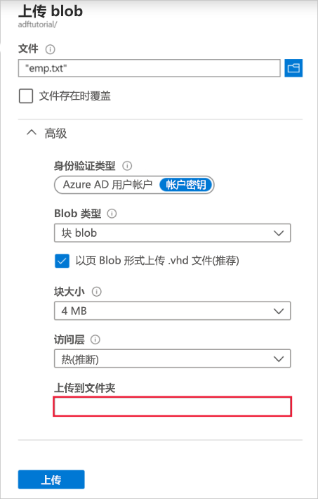

## <a name="prerequisites"></a>先决条件

### <a name="azure-subscription"></a>Azure 订阅
如果你还没有 Azure 订阅，可以在开始前创建一个[免费](https://azure.microsoft.com/free/)帐户。

### <a name="azure-roles"></a>Azure 角色
若要创建数据工厂实例，用于登录到 Azure 的用户帐户必须属于**参与者**或**所有者**角色，或者是 Azure 订阅的**管理员**。 在 Azure 门户中，单击右上角的**用户名**，然后选择“权限”查看你在订阅中拥有的权限。 如果可以访问多个订阅，请选择相应的订阅。 有关将用户添加到角色的示例说明，请参阅[添加角色](../articles/billing/billing-add-change-azure-subscription-administrator.md)一文。

### <a name="azure-storage-account"></a>Azure 存储帐户
在本快速入门中，使用通用的 Azure 存储帐户（具体说来就是 Blob 存储）作为**源**和**目标**数据存储。 如果没有通用的 Azure 存储帐户，请参阅[创建存储帐户](../articles/storage/common/storage-create-storage-account.md#create-a-storage-account)创建一个。 

#### <a name="get-storage-account-name-and-account-key"></a>获取存储帐户名称和帐户密钥
在本快速入门中，请使用 Azure 存储帐户的名称和密钥。 以下过程提供的步骤用于获取存储帐户的名称和密钥。 

1. 启动 Web 浏览器并导航到 [Azure 门户](https://portal.azure.com)。 使用 Azure 用户名和密码登录。 
2. 单击左侧菜单中的“更多服务 >”，使用“存储”关键字进行筛选，然后选择“存储帐户”。

    
3. 在存储帐户列表中，通过筛选找出你的存储帐户（如果需要），然后选择**你的存储帐户**。 
4. 在“存储帐户”页的菜单上选择“访问密钥”。

    
5. 将“存储帐户名称”和“key1”字段的值复制到剪贴板。 将这些值粘贴到记事本或任何其他编辑器中，然后进行保存。 本快速入门后面会用到它们。   

#### <a name="create-input-folder-and-files"></a>创建 input 文件夹和文件
此部分在 Azure Blob 存储中创建名为 **adftutorial** 的 Blob 容器。 然后，在容器中创建名为 **input** 的文件夹，再将示例文件上传到 input 文件夹。 

1. 在“存储帐户”页中切换到“概览”，然后单击“Blob”。 

    
2. 在“Blob 服务”页中，单击工具栏上的“+ 容器”。 

        
3. 在“新建容器”对话框中，输入 **adftutorial** 作为名称，然后单击“确定”。 

    
4. 在容器列表中单击“adftutorial”。 

    
1. 在“容器”页中，单击工具栏上的“上传”。  

    
6. 在“上传 Blob”页中，单击“高级”。

    
7. 启动**记事本**，创建包含以下内容的名为 **emp.txt** 的文件：将其保存在 **c:\ADFv2QuickStartPSH** 文件夹中（如果 **ADFv2QuickStartPSH** 文件夹不存在，请创建）。
    
    ```
    John, Doe
    Jane, Doe
    ```    
8. 在 Azure 门户的“上传 Blob”页上，浏览并选择 **emp.txt** 文件作为“文件”字段的值。 
9. 输入 **input** 作为“上传到文件夹”字段的值。 

        
10. 确认文件夹是 **input**、文件是 **emp.txt**，然后单击“上传”。
11. 应该会在列表中看到 **emp.txt** 文件和上传状态。 
12. 通过单击边角处的“X”关闭“上传 Blob”页。 

    
1. 使“容器”页保持打开状态。 在本快速入门结束时可以使用它来验证输出。