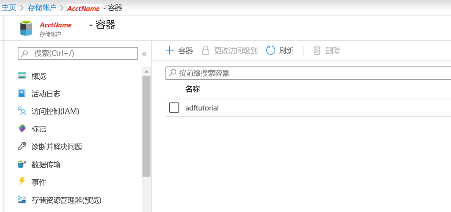

## <a name="prerequisites"></a>先决条件

### <a name="azure-subscription"></a>Azure 订阅
如果没有 Azure 订阅，请在开始之前创建一个[免费帐户](https://azure.microsoft.com/free/)。

### <a name="azure-roles"></a>Azure 角色
若要创建数据工厂实例，用于登录到 Azure 的用户帐户必须属于参与者或所有者角色，或者是 Azure 订阅的管理员。    若要查看你在订阅中拥有的权限，请转到 [Azure 门户](https://portal.azure.com)，选择右上角的用户名，然后选择“更多选项(...)”，再选择“我的权限”   。 如果可以访问多个订阅，请选择相应的订阅。

若要为数据工厂创建和管理子资源（包括数据集、链接服务、管道、触发器和集成运行时），以下要求适用：

- 若要在 Azure 门户中创建和管理子资源，你必须属于资源组级别或更高级别的**数据工厂参与者**角色。
- 若要使用 PowerShell 或 SDK 创建和管理子资源，资源级别或更高级别的**参与者**角色已足够。

有关如何将用户添加到角色的示例说明，请参阅[添加角色](../articles/billing/billing-add-change-azure-subscription-administrator.md)一文。

有关详细信息，请参阅以下文章：

- [数据工厂参与者角色](../articles/role-based-access-control/built-in-roles.md#data-factory-contributor)
- [Azure 数据工厂的角色和权限](../articles/data-factory/concepts-roles-permissions.md)

### <a name="azure-storage-account"></a>Azure 存储帐户
在本快速入门中，使用通用的 Azure 存储帐户（具体说来就是 Blob 存储）作为源和目标数据存储。   如果没有通用的 Azure 存储帐户，请参阅[创建存储帐户](../articles/storage/common/storage-quickstart-create-account.md)创建一个。 

#### <a name="get-the-storage-account-name"></a>获取存储帐户名称
在本快速入门中，将需要 Azure 存储帐户的名称。 以下过程提供的步骤用于获取存储帐户的名称： 

1. 在 Web 浏览器中，转到 [Azure 门户](https://portal.azure.com)并使用你的 Azure 用户名和密码登录。
2. 选择“所有服务” > “存储” > “存储帐户”    。
3. 在“存储帐户”页中，筛选你的存储帐户（如果需要），然后选择它  。 

#### <a name="create-a-blob-container"></a>创建 Blob 容器
本部分介绍如何在 Azure Blob 存储中创建名为 **adftutorial** 的 Blob 容器。

1. 在“存储帐户”页上，选择“概述” > “Blob”。  
2. 在 \<Account name> - “Blob”页的工具栏中，选择“容器”    。
3. 在“新建容器”  对话框中，输入 **adftutorial** 作为名称，然后选择“确定”  。 \<Account name> - “Blob”页已更新为包含容器列表中的“adftutorial”    。

   

#### <a name="add-an-input-folder-and-file-for-the-blob-container"></a>为 Blob 容器添加输入文件夹和文件
在此部分中，在刚创建的容器中创建名为“input”的文件夹，再将示例文件上传到 input 文件夹  。 在开始之前，打开文本编辑器（如记事本），并创建包含以下内容的名为“emp.txt”的文件   ：

```emp.txt
John, Doe
Jane, Doe
```

将此文件保存在 C:\ADFv2QuickStartPSH 文件夹中  。 （如果此文件夹不存在，则创建它。）然后返回到 Azure 门户并执行以下步骤：

1. 在上次离开的 \<Account name> - “Blob”页中，选择容器更新列表中的“adftutorial”    。 （如果关闭了窗口或转到了其他页面，请再次登录到 [Azure 门户](https://portal.azure.com)选择“所有服务” > “存储” > “存储帐户”，选择你的存储帐户，然后选择“Blob” > “adftutorial”      。）
2. 在“adftutorial”容器页面的工具栏上，选择“上传”   。
3. 在“上传 Blob”页中，选择“文件”框，然后浏览到 emp.txt 文件并进行选择    。
4. 展开“高级”标题  。 此页现在显示如下内容：

   
5. 在“上传到文件夹”框中，输入“输入”   。
6. 选择“上传”按钮  。 应该会在列表中看到 **emp.txt** 文件和上传状态。
7. 选择“关闭”图标 (X) 以关闭“上传 Blob”页面    。

让“adftutorial”容器页面保持打开状态  。 在本快速入门结束时可以使用它来验证输出。