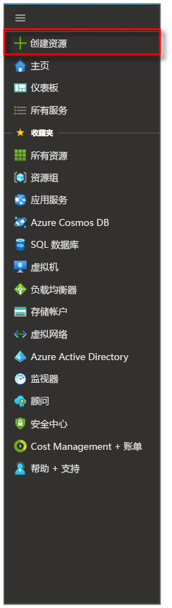
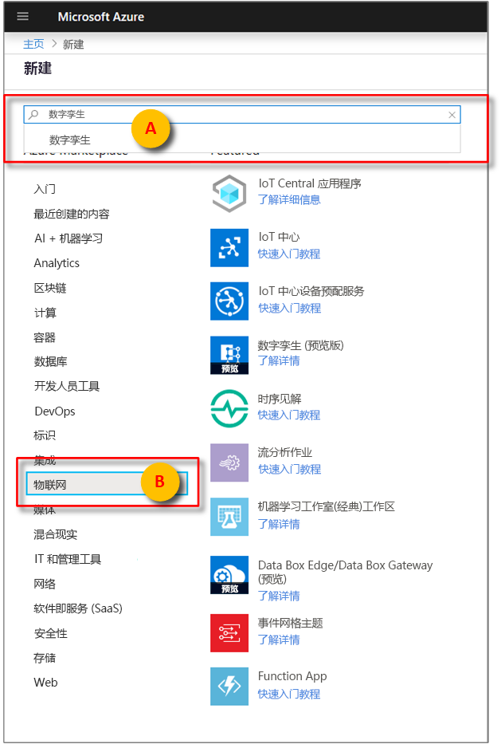
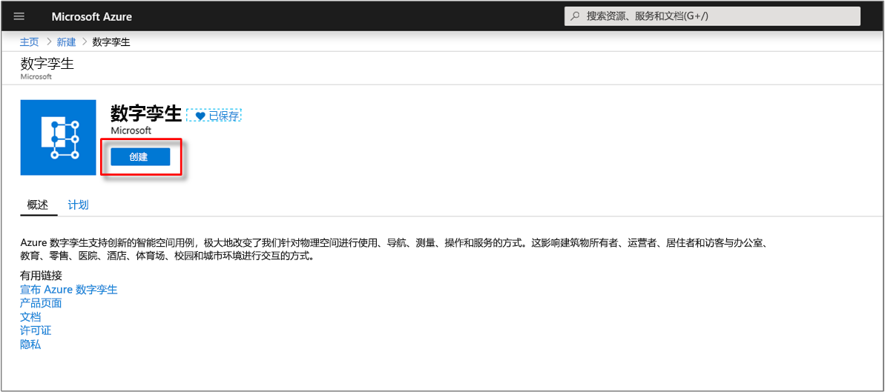
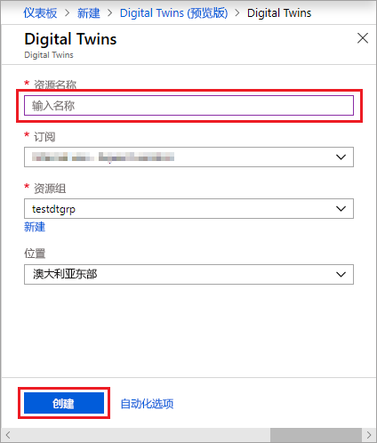
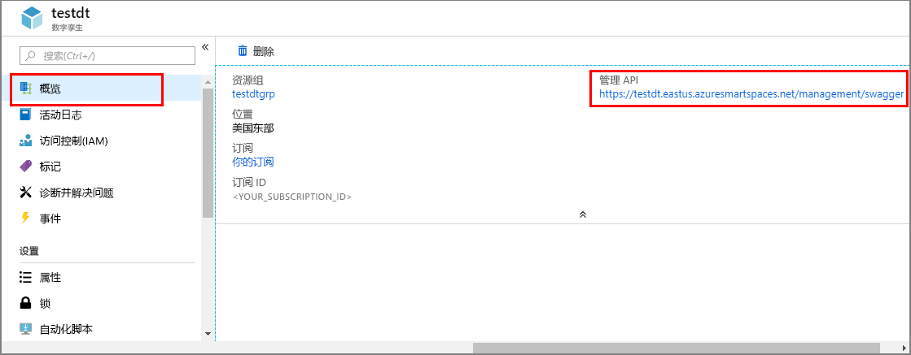

1. 登录 [Azure 门户](https://portal.azure.com)。

1. 依次选择主侧栏和“+ 创建资源”  。 

   [](./media/create-digital-twins-portal/azure-portal-create-a-resource.png#lightbox)

1. 搜索“数字孪生”  ，然后选择“数字孪生”  。 

   [](./media/create-digital-twins-portal/azure-portal-create-digital-twins.png#lightbox)

   或者，选择“物联网”  ，然后选择“数字孪生（预览版）”  。

1. 选择“创建”，启动部署过程。 

   [](./media/create-digital-twins-portal/azure-create-and-confirm-resource.png#lightbox)

1. 在“数字孪生”窗格中，输入以下信息： 
   * **资源名称**：为数字孪生实例创建一个唯一名称。
   * **订阅**：选择需要将其用于创建此数字孪生实例的订阅。 
   * **资源组**：为数字孪生实例选择或创建[资源组](https://docs.microsoft.com/azure/azure-resource-manager/resource-group-overview#resource-groups)。
   * **位置**：选择离你的设备最近的位置。

     [](./media/create-digital-twins-portal/create-digital-twins-param.png#lightbox)

1. 查看数字孪生信息，然后选择“创建”  。 创建数字孪生实例可能需要数分钟。 可在“通知”窗格中监视进度。 

1. 打开数字孪生实例的“概览”窗格。  记下“管理 API”下的链接。  管理 API URL 的格式为：  
   
   ```URL
   https://yourDigitalTwinsName.yourLocation.azuresmartspaces.net/management/swagger
   ```
   
   此 URL 将引导你到适用于实例的 Azure 数字孪生 REST API 文档。 阅读[如何使用 Azure 数字孪生 Swagger](../articles/digital-twins/how-to-use-swagger.md)，了解如何阅读和使用此 API 文档。 复制管理 API URL 并将其修改成此格式：  
    
   ```URL
   https://yourDigitalTwinsName.yourLocation.azuresmartspaces.net/management/api/v1.0/
   ```
    
   应用程序将使用此修改过的 URL 作为基 URL 来访问实例。 将此修改过的 URL 复制到一个临时文件。 下一部分将需要此 URL。

   [](./media/create-digital-twins-portal/digital-twins-management-api.png#lightbox)