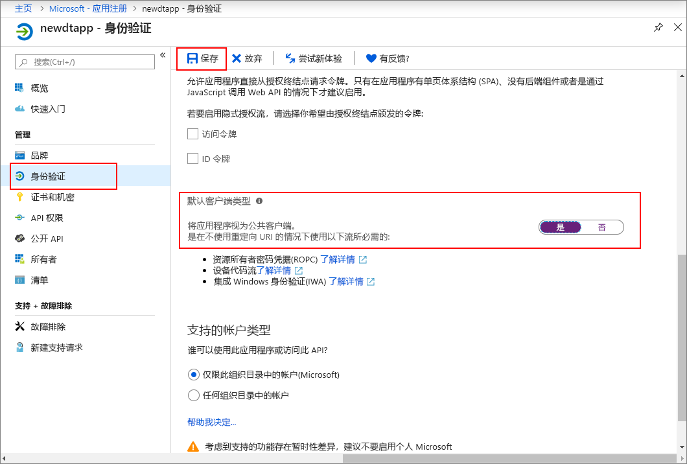

>[!NOTE]
>本部分提供有关[新的 Azure AD 应用注册](https://docs.microsoft.com/azure/active-directory/develop/quickstart-register-app)的说明。 如果仍有旧的本机应用注册，则可以使用该注册，只要它受支持就可以。 此外，如果出于某种原因，以新方式注册应用在设置中不起作用，你可以尝试创建旧的本机 AAD 应用。 请阅读[将 Azure 数字孪生应用注册到 Azure Active Directory 旧版](../articles/digital-twins/how-to-use-legacy-aad.md)以获取更多说明。 

1. 在 [Azure 门户](https://portal.azure.com)中，从左窗格打开“Azure Active Directory”  ，然后打开“应用注册”窗格  。 选择“新建注册”  按钮。

    

1. 在“名称”  框中，为此应用注册提供一个友好名称。 在“重定向 URI(可选)”  部分下，在左侧下拉列表中选择“公共客户端(移动和桌面)”  ，然后在右侧文本框中输入 `https://microsoft.com`。 选择“注册”  。

    

1. 若要确保[将应用注册为“本机应用”  ](https://docs.microsoft.com/azure/active-directory/develop/scenario-desktop-app-registration)，请打开用于应用注册的“身份验证”  窗格，然后在该窗格中向下滚动。 在“默认客户端类型”  部分中，为“将应用程序视为公共客户端”选择“是”   。 

    

1.  打开已注册的应用的“概述”  窗格，然后将以下实体的值复制到临时文件。 在以下部分中，将使用这些值配置示例应用程序。

    - **应用程序(客户端) ID**
    - **目录(租户) ID**

    

1. 打开用于应用注册的“API 权限”窗格  。 选择“添加权限”按钮  。 在“请求 API 权限”  窗格中，选择“我的组织使用的 API”  选项卡，然后搜索：
    
    1. **Azure 数字孪生**。 选择 **Azure 数字孪生** API。

        

    1. 或者，搜索“Azure 智能空间”  。 选择“Azure 智能空间服务”  API。

        

    > [!NOTE]
    > 搜索时显示的确切名称可能会因你所属的 Azure 租户而异。

1. 所选的 API 在同一个“请求 API 权限”窗格中显示为“Azure 数字孪生”   。 选择“读取 (1)”下拉列表  ，然后选中“Read.Write”复选框  。 选择“添加权限”按钮  。

    

1. 根据组织的设置，可能需要执行其他步骤才能授予对此 API 的管理员访问权限。 请联系管理员以了解详细信息。 在该管理员访问权限得到批准后，API 的“API 权限”窗格中的“需要管理员同意”列将如下所示   ：

    

