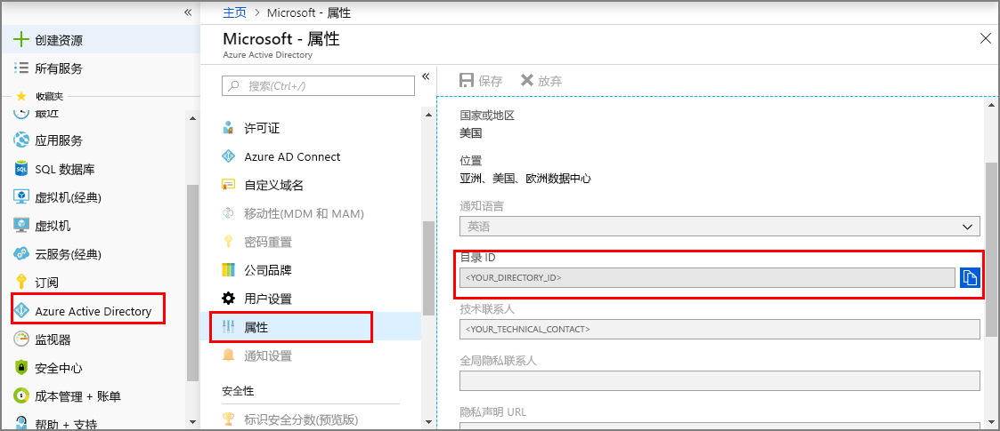
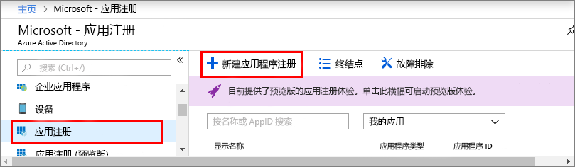

1. 在 [Azure 门户](https://portal.azure.com)中，从左侧导航面板打开 **Azure Active Directory**，然后打开“属性”窗格。 将“目录 ID”复制到一个临时文件。 将在下一部分使用此值来配置示例应用程序。

    

1. 打开“应用注册”窗格，然后单击“新建应用程序注册”按钮。
    
    

1. 在“名称”字段中，为此应用注册提供一个友好名称。 选择“本机”作为“应用程序类型”，然后选择 **_https://microsoft.com_** 作为“重定向 URI”。 单击“创建”。

    

1. 打开注册的应用，将“应用程序 ID”字段的值复制到一个临时文件中，该值用于标识 Azure Active Directory 应用。 将在下一部分使用应用程序 ID 来配置示例应用程序。

    

1. 打开应用注册窗格，单击“设置” > “所需的权限”：
    - 在左上角单击“添加”，打开“添加 API 访问权限”窗格。
    - 单击“选择 API”，搜索“Azure 数字孪生”。 如果搜索没有找到该 API，请改为搜索“Azure 智能空间”。
    - 选择“Azure 数字孪生(Azure 智能空间服务)”选项，然后单击“选择”。
    - 单击“选择权限”。 勾选“读/写访问权限”委托权限框，然后单击“选择”。
    - 在“添加 API 访问权限”窗格中，单击“完成”。
    - 在“所需的权限”窗格中单击“授予权限”按钮，接受显示的确认。

       
