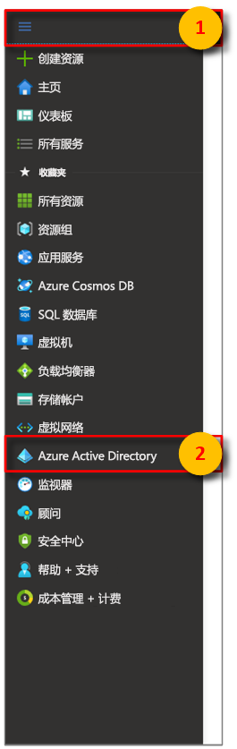
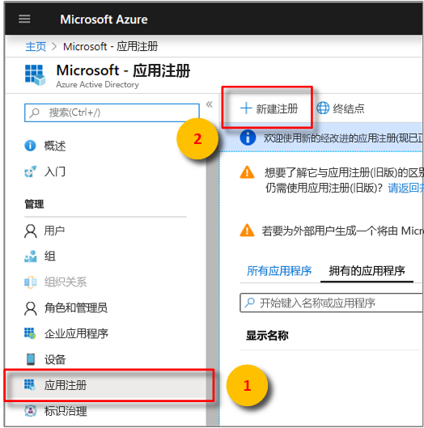
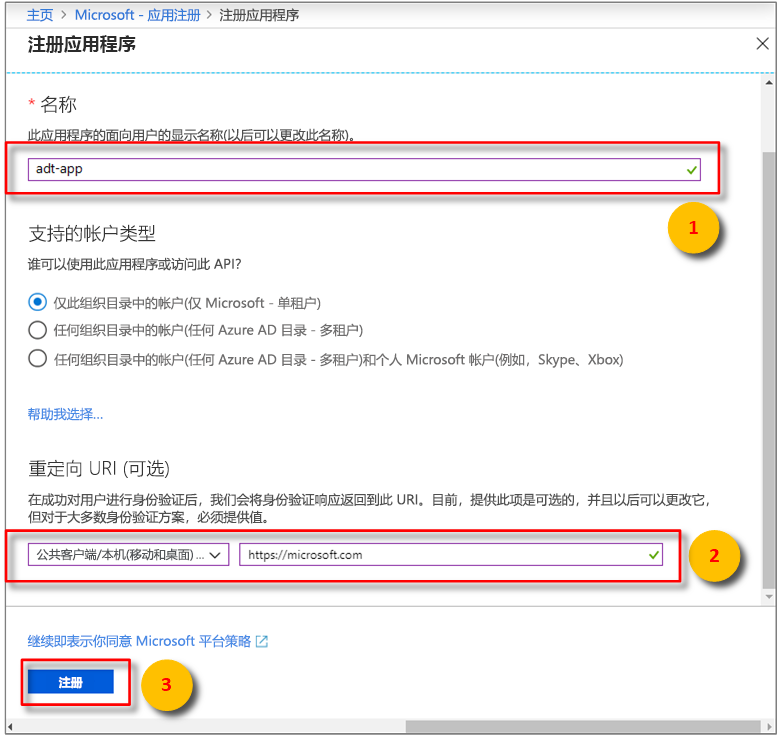
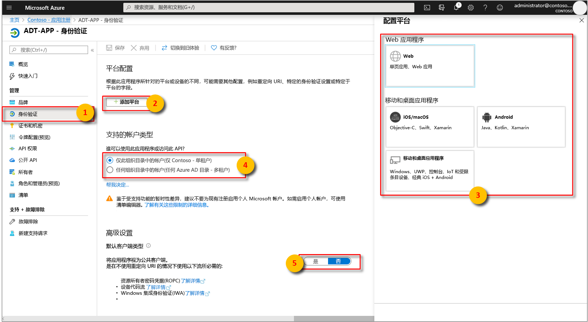
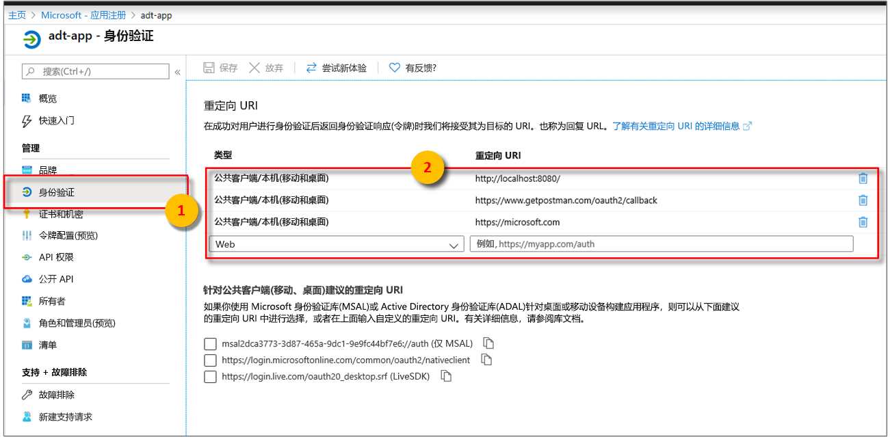
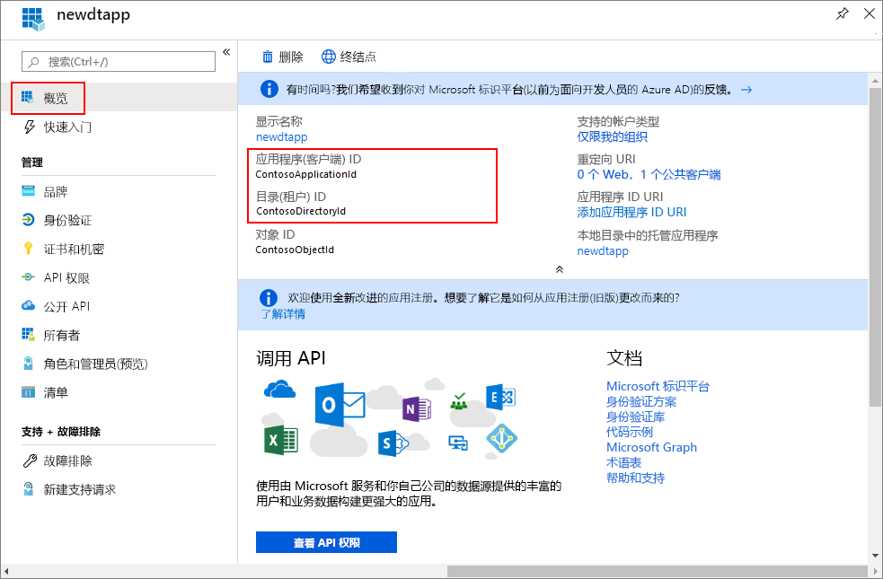
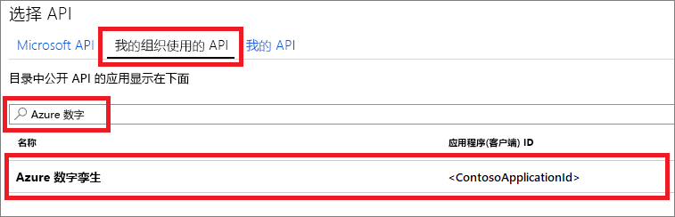
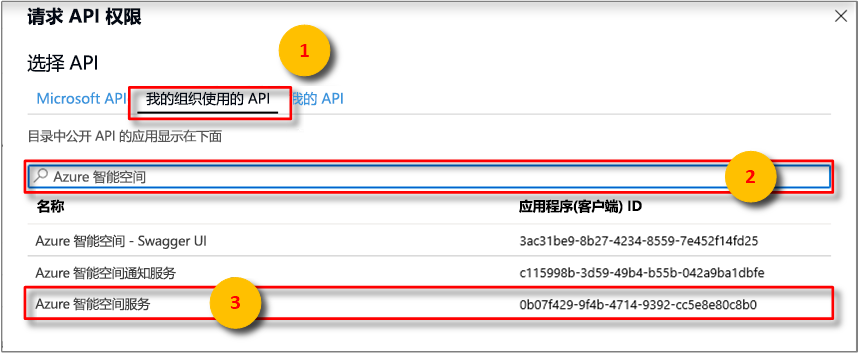
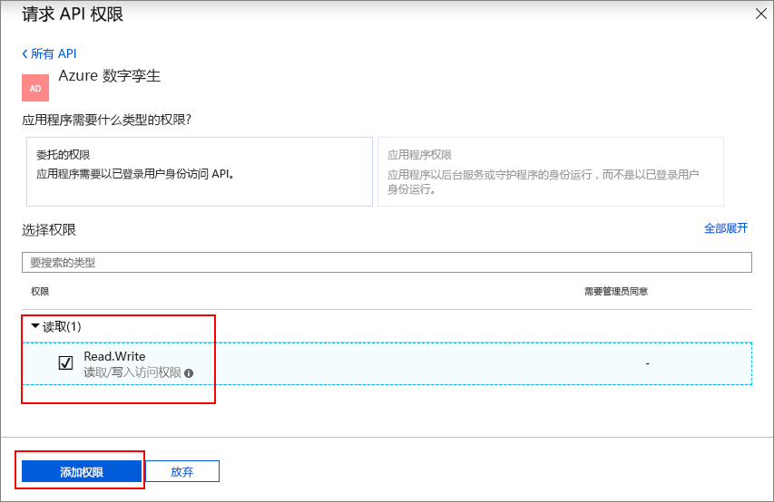
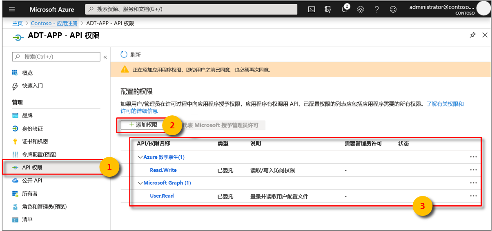

>[!NOTE]
>本部分提供有关 [Azure AD 应用注册](https://docs.microsoft.com/azure/active-directory/develop/quickstart-register-app)的说明。

1. 在 [Azure 门户](https://portal.azure.com)中，从可展开的左菜单打开“Azure Active Directory”  ，然后打开“应用注册”窗格  。 

    

1. 选择“+ 新建注册”  按钮。

    

1. 在“名称”  框中，为此应用注册提供一个友好名称。 

    1. 在“重定向 URI (可选)”  部分下的文本框中输入 `https://microsoft.com`。     

    1. 验证 Azure Active Directory 应用支持哪些帐户和租户。

    1. 选择“注册”  。

    

1. “身份验证”  边栏选项卡可指定重要的身份验证配置设置。 

    1. 通过选择“+ 添加平台”，添加“重定向 URI”并配置“访问令牌”。

    1. 选择“是”  以指定该应用为“公共客户端”  。

    1. 验证 Azure Active Directory 应用支持哪些帐户和租户。

    

1. 选择适当的平台后，在用户界面右侧的侧面板中配置“重定向 URI”  和“访问令牌”  。

    1. “重定向 URI”  必须与身份验证请求所提供的地址相匹配：

        * 对于本地开发环境中托管的应用，请选择“公共客户端(移动和桌面)”  。 确保将“公共客户端”  设为“是”  。
        * 对于 Azure 应用服务上托管的单页应用，请选择“Web”  。

    1. 确定“注销 URL”  是否合适。

    1. 通过选中“访问令牌”  或“ID 令牌”  来启用隐式授权流。
                
    

    单击“配置”  ，然后单击“保存”  。

1.  打开已注册的应用的“概述”  窗格，然后将以下实体的值复制到临时文件。 在以下部分中，将使用这些值配置示例应用程序。

    - **应用程序(客户端) ID**
    - **目录(租户) ID**

    

1. 打开用于应用注册的“API 权限”窗格  。 选择“+ 添加权限”按钮  。 在“请求 API 权限”  窗格中，选择“我的组织使用的 API”  选项卡，然后搜索以下任意一项：
    
    1. `Azure Digital Twins` 列中的一个值匹配。 选择 **Azure 数字孪生** API。

        

    1. 或者，搜索 `Azure Smart Spaces Service`。 选择“Azure 智能空间服务”  API。

        

    > [!IMPORTANT]
    > 将显示的 Azure AD API 名称和 ID 取决于租户：
    > * 测试租户和客户帐户应搜索 `Azure Digital Twins`。
    > * 其他 Microsoft 帐户应搜索 `Azure Smart Spaces Service`。

1. 选择后，任一 API 会在同一个“请求 API 权限”窗格中显示为“Azure 数字孪生”   。 选择“读取”下拉选项  ，然后选中“Read.Write”复选框  。 选择“添加权限”按钮  。

    

1. 根据组织的设置，可能需要执行其他步骤才能授予对此 API 的管理员访问权限。 请联系管理员以了解详细信息。 在该管理员访问权限得到批准后，“API 权限”窗格中的“需要管理员同意”列将显示你的权限   。 

    

    验证是否显示“Azure 数字孪生”  。
