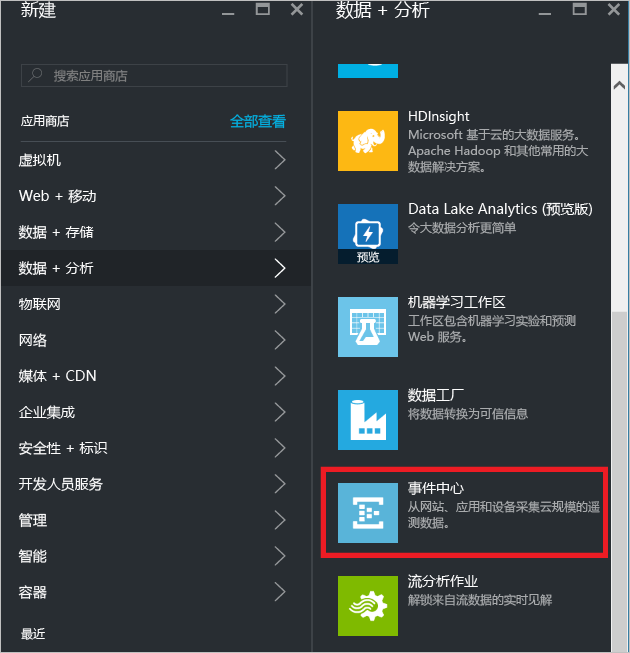
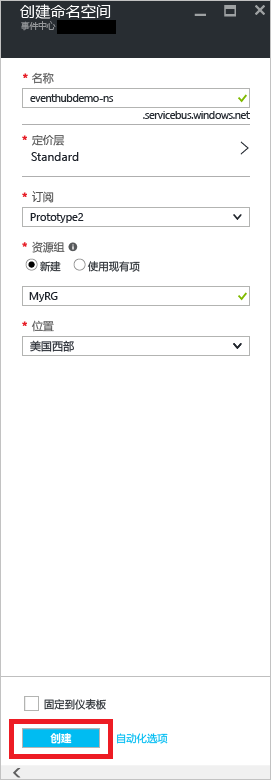
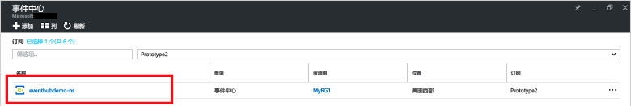
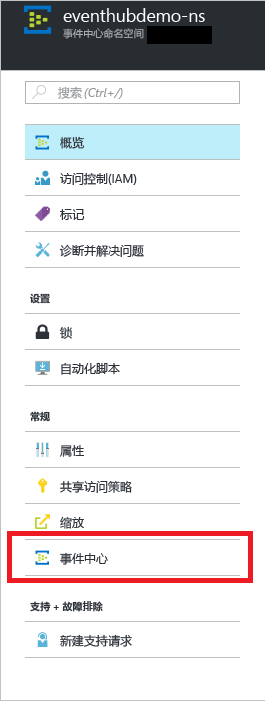
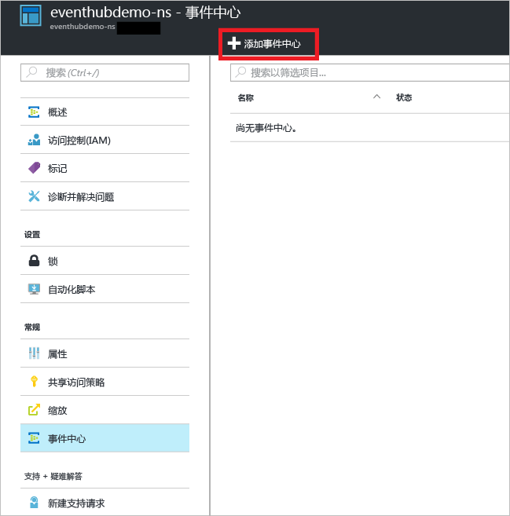
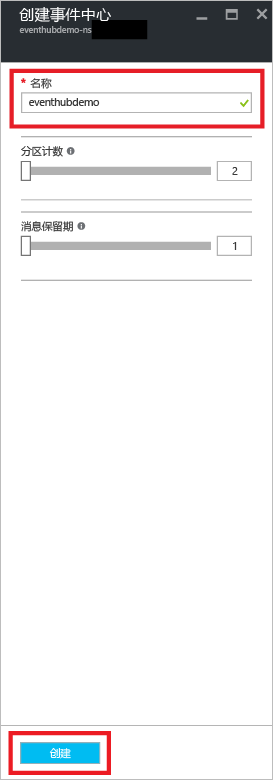
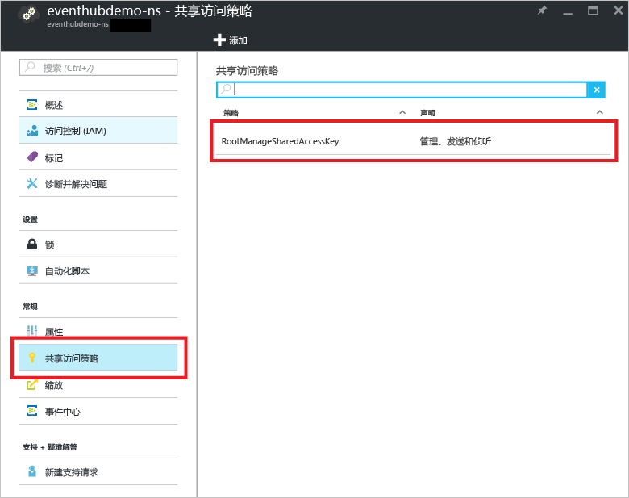

## 创建事件中心
1. 登录到 [Azure 门户][Azure 门户]，然后单击屏幕左上角的“新建”。
2. 单击“物联网”，然后单击“事件中心”。
   
    
3. 在“创建命名空间”  边栏选项卡中，输入命名空间名称。 系统会立即检查该名称是否可用。
   
    
4. 在确保命名空间名称可用后，选择定价层（基础版或标准版）。 另外，请选择一个 Azure 订阅、资源组以及要创建该资源的位置。 
5. 单击“创建”  创建命名空间。
6. 在“事件中心”命名空间列表中，单击新创建的命名空间。      
   
    
7. 在命名空间边栏选项卡中，单击“事件中心” 。
   
    
8. 在边栏选项卡顶部，单击“添加事件中心” 。
   
    
9. 为事件中心键入名称，然后单击“创建” 。
   
    
10. 在“事件中心”列表中，单击新创建的事件中心名称。 
    
     
11. 返回命名空间边栏选项卡（不是特定的事件中心边栏选项卡），单击“共享访问策略”，然后单击“RootManageSharedAccessKey”。
    
     
12. 单击复制按钮，将 **RootManageSharedAccessKey** 连接字符串复制到剪贴板。 保存该连接字符串，以便本教程以后使用。
    
     

现在，你的事件中心就创建好了，你已经有了收发事件所需的连接字符串。

[Azure 门户]: https://portal.azure.com/

<!--HONumber=Nov16_HO4-->

