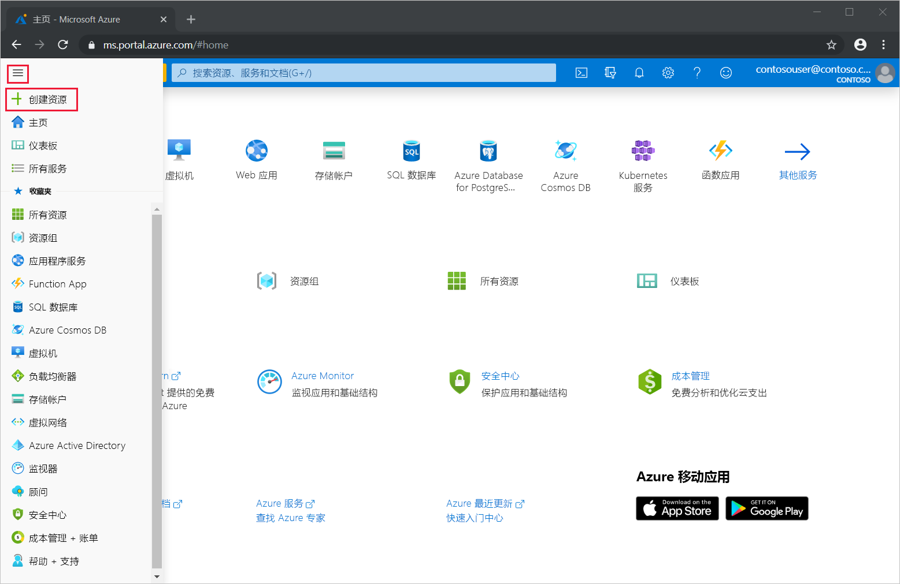
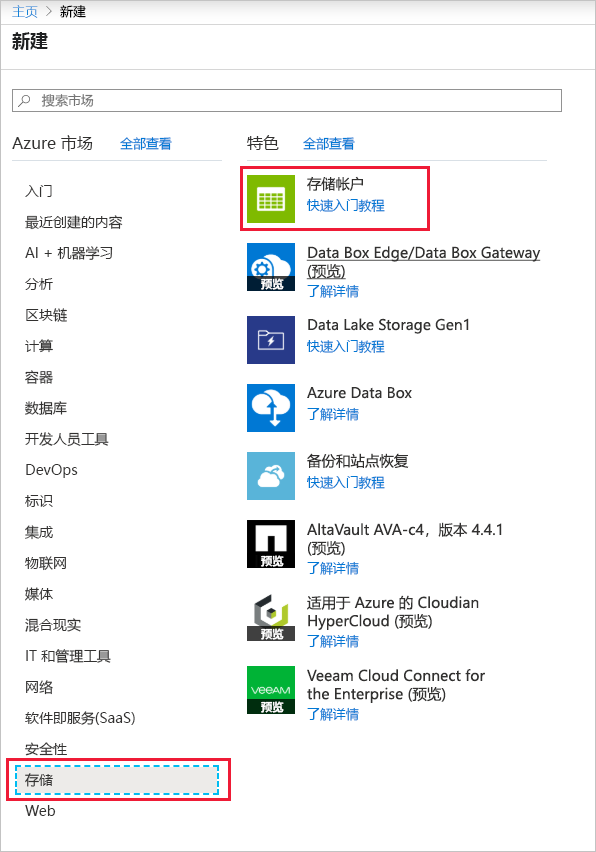
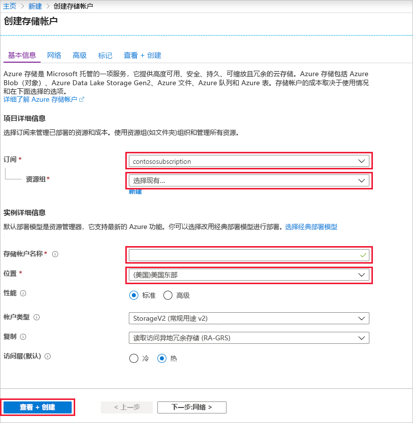
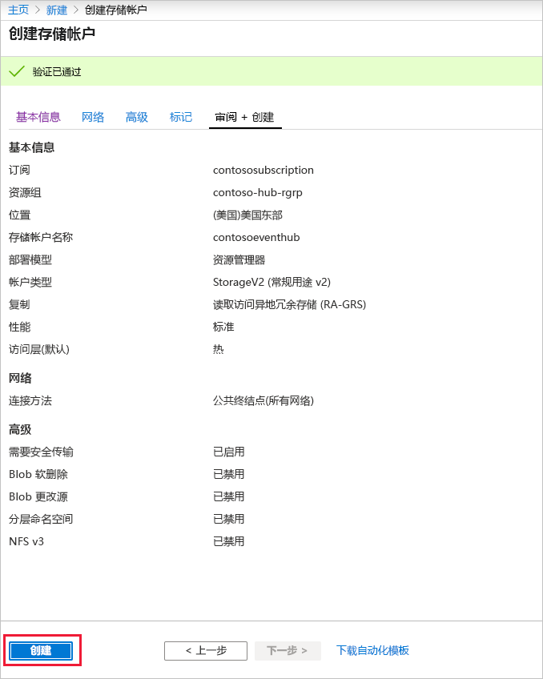
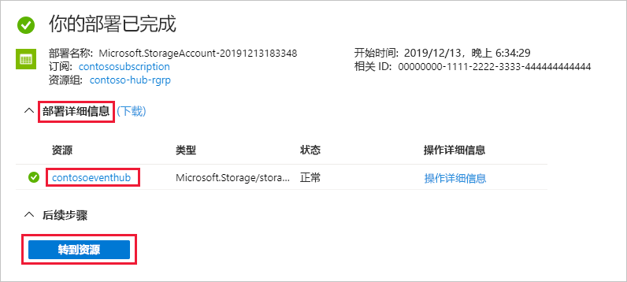
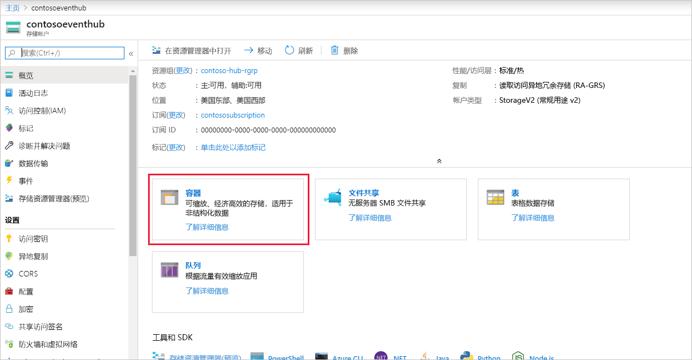
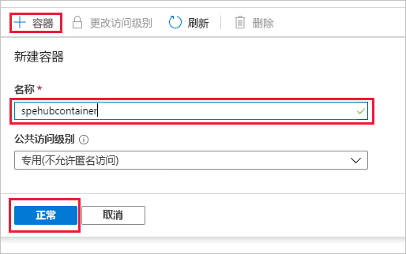

### 为事件处理程序主机创建存储帐户
事件处理程序主机是一个智能代理，它通过管理持久性检查点和并行接收操作，来简化从事件中心接收事件的过程。 对于检查点，事件处理程序主机需要一个存储帐户。 以下示例演示如何创建存储帐户，以及如何获取其密钥以进行访问：

1. 在 Azure 门户菜单中，选择“创建资源”  。

    

2. 选择“存储” > “存储帐户”。
   
    

3. 在“创建存储帐户”页中执行以下步骤：  

   1. 输入“存储帐户名称”  。
   2. 选择包含事件中心的 Azure 订阅。 
   3. 选择或创建包含事件中心的“资源组”。 
   4. 选择要在其中创建资源的“位置”。  
   5. 选择“查看 + 创建”  。
   
        

4. 在“查看 + 创建”  页上查看值，然后选择“创建”。  

    
5. 在通知中看到“部署已成功”消息后，选择“前往资源”以打开“存储帐户”页   。 或者，可以展开“部署详细信息”，然后从资源列表中选择新资源  。  

     
6. 选择“容器”  。

    
7. 选择顶部的“+ 容器”  ，为容器输入“名称”  ，然后选择“确定”  。 

    
8. 从“存储帐户”页菜单中选择“访问密钥”，并复制“key1”的值    。

    将以下值保存到记事本或其他某个临时位置。
    - 存储帐户的名称
    - 存储帐户的访问密钥
    - 容器的名称
