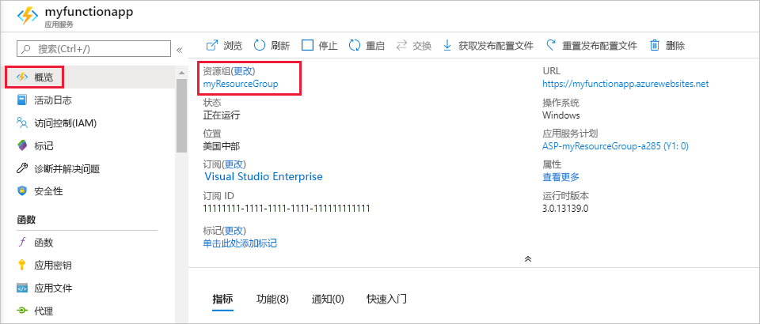

1. 在 Visual Studio Code 中，按 F1 键打开命令面板。 在命令面板中，搜索并选择 `Azure Functions: Open in portal`。

1. 选择你的函数应用，然后按 Enter。 随即将在 [Azure 门户](https://portal.azure.com)中打开函数应用页面。

1. 在“概述”选项卡上，选择“资源组”下的命名连接   。

    

1. 在“资源组”页中查看所包括的资源的列表，然后验证这些资源是否是要删除的。 
 
1. 选择“删除资源组”  ，然后按说明操作。

   可能需要数分钟才能删除完毕。 完成后会显示一个通知，持续数秒。 也可以选择页面顶部的钟形图标来查看通知。