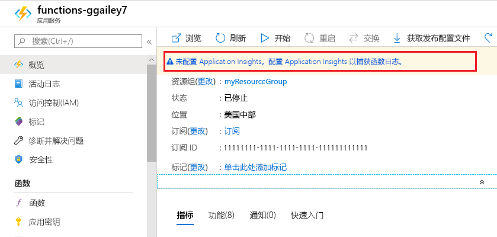
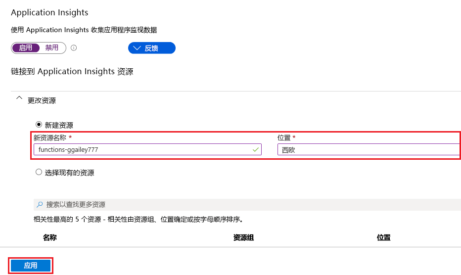

可以通过 Functions 轻松地将 Application Insights 集成从 [Azure 门户]添加到某个函数应用。

1. 在 [门户][Azure 门户]中选择“所有服务”>“Function App”，接着选择你的函数应用，然后选择窗口顶部的“Application Insights”横幅  

    

1. 创建 Application Insights 资源，方法是使用图像下面表中指定的设置：

   

    | 设置      | 建议的值  | 说明                                        |
    | ------------ |  ------- | -------------------------------------------------- |
    | **名称** | 唯一的应用名称 | 使用与函数应用相同的名称是最方便的，该名称在订阅中必须独一无二。 | 
    | **位置** | 西欧 | 尽可能使用与函数应用相同的[区域](https://azure.microsoft.com/regions/)，或与之相近的区域。 |

1. 选择“确定”。  Application Insights 资源在与函数应用相同的资源组和订阅中创建。 创建完以后，请关闭 Application Insights 窗口。

1. 回到函数应用中，选择“应用程序设置”，然后向下滚动到“应用程序设置”。   如果看到名为 `APPINSIGHTS_INSTRUMENTATIONKEY` 的设置，则表明已为在 Azure 中运行的函数应用启用 Application Insights 集成。

[Azure 门户]: https://portal.azure.com
