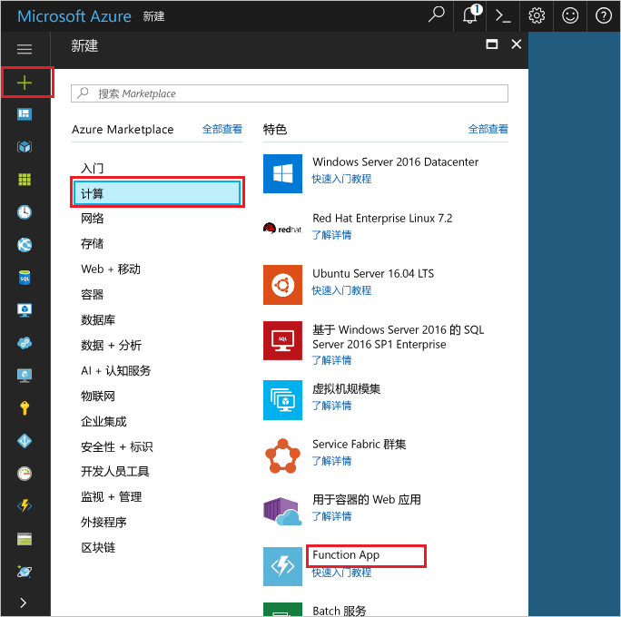

1. 单击 Azure 门户左上角的“新建”按钮。

1. 单击“计算” > “函数应用”。 然后，使用表中指定的 Function App 设置。

    

    | 设置      | 建议的值  | 说明                                        |
    | ------------ |  ------- | -------------------------------------------------- |
    | **应用名称** | 全局唯一名称 | 用于标识新 Function App 的名称。 有效的字符是 `a-z`、`0-9` 和 `-`。  | 
    | **订阅** | 订阅 | 要在其下创建此新函数应用的订阅。 | 
    | [资源组](../articles/azure-resource-manager/resource-group-overview.md) |  myResourceGroup | 要在其中创建 Function App 的新资源组的名称。 | 
    | [托管计划](../articles/azure-functions/functions-scale.md) |   消耗量计划 | 定义如何将资源分配给 Function App 的托管计划。 在默认的**消耗计划**中，根据函数需求动态添加资源。 只为函数运行时间付费。   |
    | **位置** | 欧洲西部 | 选择离你近或离函数将访问的其他服务近的位置。 |
    | [存储帐户](../articles/storage/common/storage-create-storage-account.md#create-a-storage-account) |  全局唯一名称 |  Function App 使用的新存储帐户的名称。 存储帐户名称必须为 3 到 24 个字符，并且只能包含数字和小写字母。 也可以使用现有帐户。 |

1. 单击“创建”来预配和部署新的 Function App。
