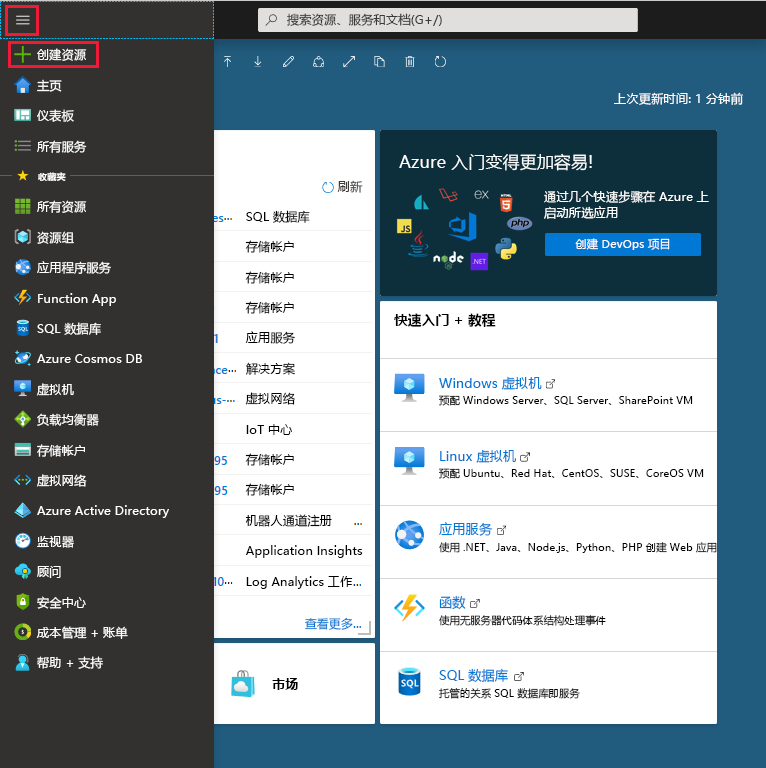
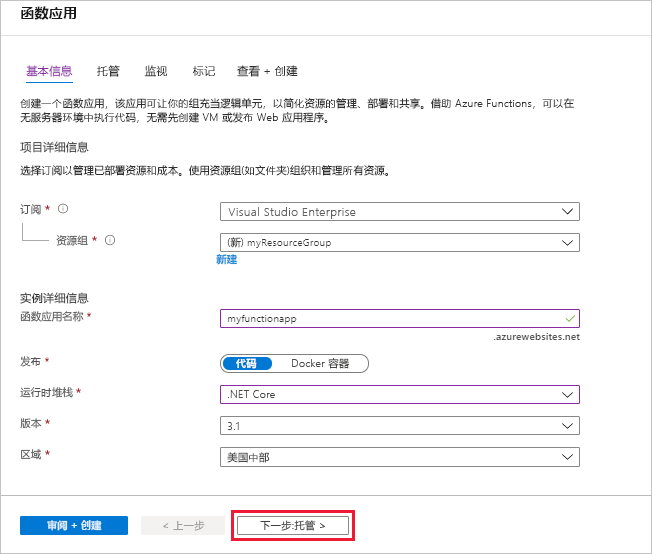
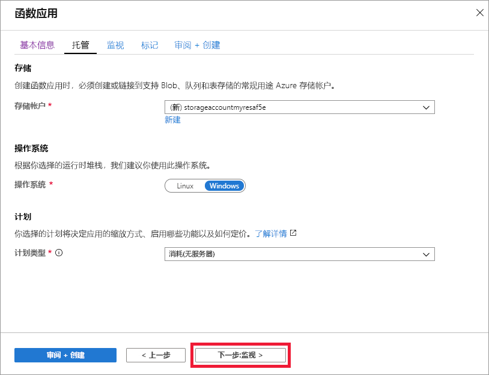
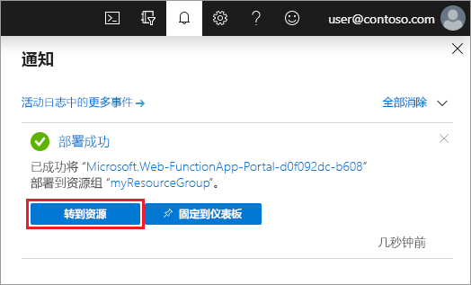

1. 在 Azure 门户菜单中，选择“创建资源”  。

    

1. 在“新建”页面，选择“计算” > “函数应用”    。

1. 使用图像下面的表格中指定的函数应用设置。

    

    | 设置      | 建议的值  | Description |
    | ------------ | ---------------- | ----------- |
    | **订阅** | 订阅 | 要在其下创建此新函数应用的订阅。 |
    |  [资源组](../articles/azure-resource-manager/resource-group-overview.md) |  *myResourceGroup* | 要在其中创建 Function App 的新资源组的名称。 |
    | **函数应用名称** | 全局唯一名称 | 用于标识新 Function App 的名称。 有效字符为 `a-z`（不区分大小写）、`0-9` 和 `-`。  |
    |**发布**| 代码 | 用于发布代码文件或 Docker 容器的选项。 |
    | **运行时堆栈** | 首选语言 | 选择支持你喜欢的函数编程语言的运行时。 对于 C# 和 F# 函数，选择 **.NET**。 |
    |**区域**| 首选区域 | 选择离你近或离函数访问的其他服务近的[区域](https://azure.microsoft.com/regions/)。 |

    选择“下一步:  托管 >”按钮。

1. 输入以下用于托管的设置。

    

    | 设置      | 建议的值  | 说明 |
    | ------------ | ---------------- | ----------- |
    |  [存储帐户](../articles/storage/common/storage-quickstart-create-account.md) |  全局唯一名称 |  创建函数应用使用的存储帐户。 存储帐户名称必须为 3 到 24 个字符，并且只能包含数字和小写字母。 也可使用现有帐户，但该帐户必须符合[存储帐户要求](../articles/azure-functions/functions-scale.md#storage-account-requirements)。 |
    |**操作系统**| 首选操作系统 | 系统会根据你的运行时堆栈选择为你预先选择一个操作系统，但你可以根据需要更改该设置。 |
    | **[计划](../articles/azure-functions/functions-scale.md)** | 消耗计划 | 定义如何将资源分配给 Function App 的托管计划。 在默认的**消耗计划**中，根据函数需求动态添加资源。 在此[无服务器](https://azure.microsoft.com/overview/serverless-computing/)托管中，只需为函数运行时间付费。 按应用服务计划运行时，必须管理[函数应用的缩放](../articles/azure-functions/functions-scale.md)。  |

    选择“下一步:  监视 >”按钮。

1. 输入以下用于监视的设置。

    

    | 设置      | 建议的值  | 说明 |
    | ------------ | ---------------- | ----------- |
    | **[Application Insights](../articles/azure-functions/functions-monitoring.md)** | 默认 | 在最近的受支持的区域中，创建一个具有相同应用名称  的 Application Insights 资源。 展开此设置即可更改“新建资源名称”，或者在 [Azure 地理位置](https://azure.microsoft.com/global-infrastructure/geographies/)中选择另一个需要在其中存储数据的**位置**。  |

    选择“查看 + 创建”  ，以便查看应用配置选择。

1. 选择“创建”  以预配和部署函数应用。

1. 选择门户右上角的“通知”图标，留意是否显示“部署成功”消息。 

    

1. 选择“转到资源”  ，查看新的函数应用。 还可选择“固定到仪表板”  。 固定可以更轻松地从仪表板返回此函数应用资源。
