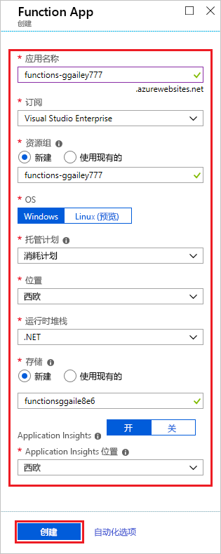
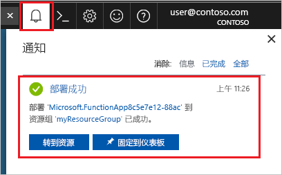

1. 选择 Azure 门户左上角的“创建资源”按钮，然后选择“计算” > “函数应用”。

    

2. 使用图像下面的表格中指定的函数应用设置。

    

    | 设置      | 建议的值  | 说明                                        |
    | ------------ |  ------- | -------------------------------------------------- |
    | **应用名称** | 全局唯一名称 | 用于标识新 Function App 的名称。 有效的字符是 `a-z`、`0-9` 和 `-`。  | 
    | **订阅** | 订阅 | 要在其下创建此新函数应用的订阅。 | 
    | [资源组](../articles/azure-resource-manager/resource-group-overview.md) |  myResourceGroup | 要在其中创建 Function App 的新资源组的名称。 |
    | **OS** | Windows | Linux 上的无服务器托管目前为预览版。 有关详细信息，请参阅[此注意事项文章](https://aka.ms/funclinux)。|
    | [托管计划](../articles/azure-functions/functions-scale.md) | 消耗量计划 | 定义如何将资源分配给 Function App 的托管计划。 在默认的**消耗计划**中，根据函数需求动态添加资源。 在此[无服务器](https://azure.microsoft.com/overview/serverless-computing/)托管中，只需为函数运行时间付费。 按应用服务计划运行时，必须管理[函数应用的缩放](../articles/azure-functions/functions-scale.md)。  |
    | **位置** | 西欧 | 选择离你近或离函数访问的其他服务近的[区域](https://azure.microsoft.com/regions/)。 |
    | **运行时堆栈** | 首选语言 | 选择支持你喜欢的函数编程语言的运行时。 对于 C# 和 F# 函数，选择 **.NET**。 |
    | **[存储](../articles/storage/common/storage-quickstart-create-account.md)** |  全局唯一名称 |  创建函数应用使用的存储帐户。 存储帐户名称必须为 3 到 24 个字符，并且只能包含数字和小写字母。 也可使用现有帐户，但该帐户必须符合[存储帐户要求](../articles/azure-functions/functions-scale.md#storage-account-requirements)。 |
    | **[Application Insights](../articles/azure-functions/functions-monitoring.md)** | 默认 | 在最近的受支持的区域中，创建一个具有相同应用名称的 Application Insights 资源。 展开此设置即可更改“新建资源名称”，或者在 [Azure 地理位置](https://azure.microsoft.com/global-infrastructure/geographies/)中选择另一个需要在其中存储数据的**位置**。 |

3. 选择“创建”以预配和部署函数应用。

4. 选择门户右上角的“通知”图标，留意是否显示“部署成功”消息。

    

5. 选择“转到资源”，查看新的函数应用。 还可选择“固定到仪表板”。 固定可以更轻松地从仪表板返回此函数应用资源。
