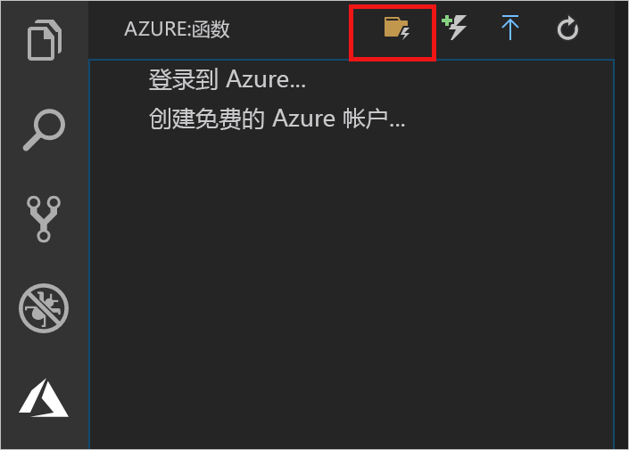
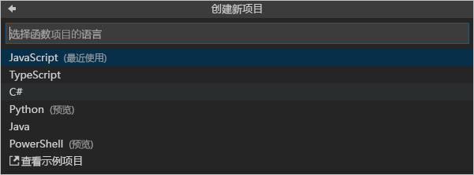

## 创建 Azure Functions 项目

使用 Visual Studio Code 中的 Azure Functions 项目模板可创建一个项目，该项目可发布到 Azure 中的函数应用。 函数应用可将函数分组为一个逻辑单元，以用于管理、部署和共享资源。

1. 在 Visual Studio Code 中，选择 Azure 徽标以显示“Azure:Functions”区域，然后选择“创建新项目”图标。

    

1. 为项目工作区选择位置，然后选择“选择”。

    > [!NOTE]
    > 本文已设计为在工作区之外完成。 在这种情况下，请不要选择属于工作区内的项目文件夹。

1. 选择函数应用项目的语言。 在本文中将使用 JavaScript。
    

1. 出现提示时，选择“添加到工作区”。

Visual Studio Code 将在新的工作区中创建函数应用项目。 此项目包含 [host.json](../articles/azure-functions/functions-host-json.md) 和 [local.settings.json](../articles/azure-functions/functions-run-local.md#local-settings-file) 配置文件以及任何特定于语言的项目文件。 在项目文件夹中还会有新的 Git 存储库。