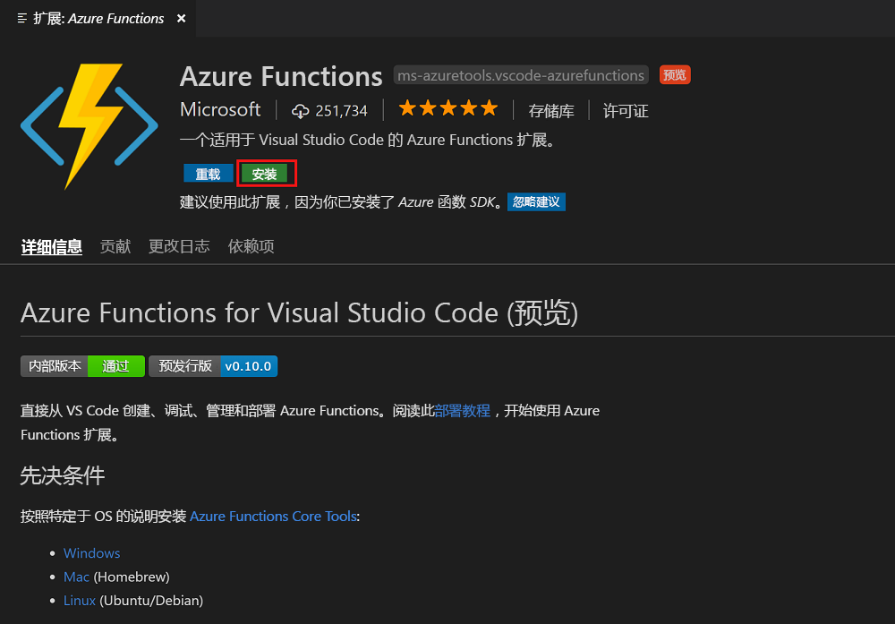
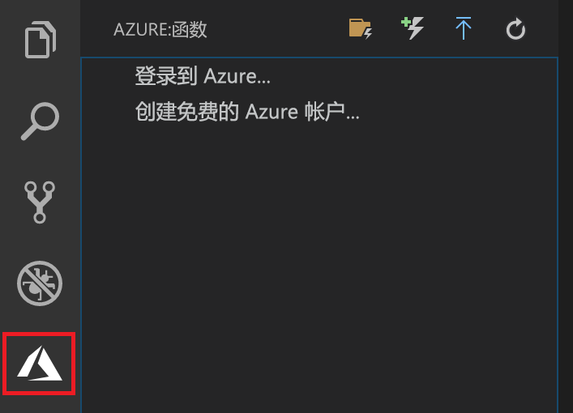

## 安装 Azure Functions 扩展

Azure Functions 扩展用于创建、测试函数以及将函数部署到 Azure。

1. 在 Visual Studio Code 中打开“扩展”并搜索 `azure functions`，或者[在 Visual Studio Code 中打开此链接](vscode:extension/ms-azuretools.vscode-azurefunctions)。

1. 选择“安装”将扩展安装到 Visual Studio Code。

    

1. 重新启动 Visual Studio Code，然后选择“活动”栏上的 Azure 图标。 此时侧边栏中应显示 Azure Functions 区域。

    