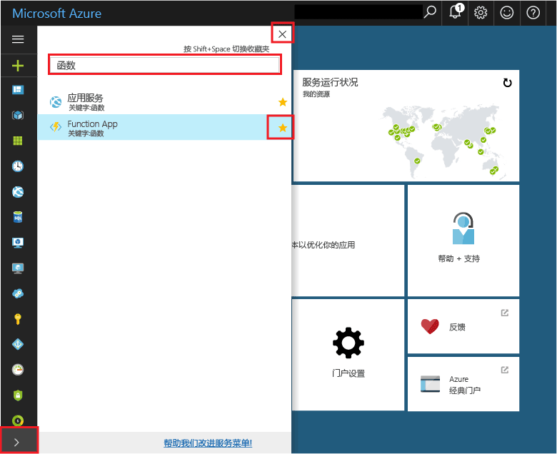

## 将 Function App 添加到门户收藏夹 

如果尚未这样做，请将 Function App 添加到 Azure 门户中的收藏夹。 这样可以更轻松地查找 Function App。 如果已执行此操作，请跳至下一节。 

1. 登录到 [Azure 门户](https://portal.azure.com/)。

2. 单击左下角的箭头以展开所有服务，在“筛选器”字段中键入 `Functions`，然后单击“Function App”旁边的星形。  
 
    

    这将在门户左侧的菜单中添加“函数”图标。

3. 关闭菜单，然后向下滚动到底部才能看到“函数”图标。 单击该图标可查看所有 Function App 的列表。 单击 Function App 以在此应用中使用函数。 
 
    
 
     