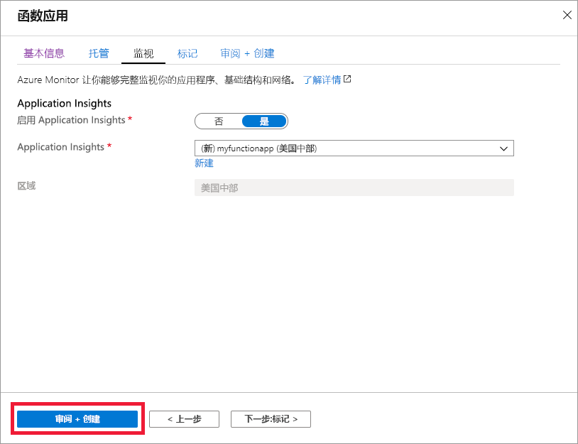

1. 在 Azure 门户菜单或“主页”页中，选择“创建资源”   。

1. 在“新建”页面，选择“计算” > “函数应用”    。

1. 在 "**基本**信息" 页上，使用下表中指定的 "函数应用设置"：

    | 设置      | 建议的值  | 说明 |
    | ------------ | ---------------- | ----------- |
    | **订阅** | 订阅 | 要在其下创建此新函数应用的订阅。 |
    |  [资源组](../articles/azure-resource-manager/management/overview.md) |  *myResourceGroup* | 要在其中创建 Function App 的新资源组的名称。 |
    | **函数应用名称** | 全局唯一名称 | 用于标识新 Function App 的名称。 有效字符为 `a-z`（不区分大小写）、`0-9` 和 `-`。  |
    |**发布**| 代码 | 用于发布代码文件或 Docker 容器的选项。 |
    | **运行时堆栈** | 首选语言 | 选择支持你喜欢的函数编程语言的运行时。 为 c # 和 F # 函数选择 **.net** 。 |
    |**区域**| 首选区域 | 选择离你近或离函数访问的其他服务近的[区域](https://azure.microsoft.com/regions/)。 |

    

1. 选择**下一步：承载**。 在 "**托管**" 页上，输入以下设置：

    | 设置      | 建议的值  | 说明 |
    | ------------ | ---------------- | ----------- |
    |  [存储帐户](../articles/storage/common/storage-account-create.md) |  全局唯一名称 |  创建函数应用使用的存储帐户。 存储帐户名称必须为 3 到 24 个字符，并且只能包含数字和小写字母。 也可使用现有帐户，但该帐户必须符合[存储帐户要求](../articles/azure-functions/functions-scale.md#storage-account-requirements)。 |
    |**操作系统**| 首选操作系统 | 系统会根据你的运行时堆栈选择为你预先选择一个操作系统，但你可以根据需要更改该设置。 |
    | **[计划](../articles/azure-functions/functions-scale.md)** | 高级 | 定义如何将资源分配给 Function App 的托管计划。 选择 "**高级**"，然后选择 " **Windows 计划**" 和 " **Sku 和大小**" 的默认值。 |

    

1. 选择 "**下一步：监视**"。 在 "**监视**" 页上，输入以下设置：

    | 设置      | 建议的值  | 说明 |
    | ------------ | ---------------- | ----------- |
    | **[Application Insights](../articles/azure-functions/functions-monitoring.md)** | 默认 | 在最近的受支持的区域中，创建一个具有相同应用名称  的 Application Insights 资源。 通过展开此设置，你可以更改**新资源名称**或在[Azure 地域](https://azure.microsoft.com/global-infrastructure/geographies/)中选择其他**位置**来存储数据。 |

    

1. 选择“查看 + 创建”  ，以便查看应用配置选择。

1. 在“查看 + 创建”页上查看设置，然后选择“创建”来预配并部署函数应用   。

1. 选择门户右上角的 "**通知**" 图标，然后查看 "**部署已成功**" 消息。

1. 选择“转到资源”  ，查看新的函数应用。 还可选择“固定到仪表板”  。 固定可以更轻松地从仪表板返回此函数应用资源。

    