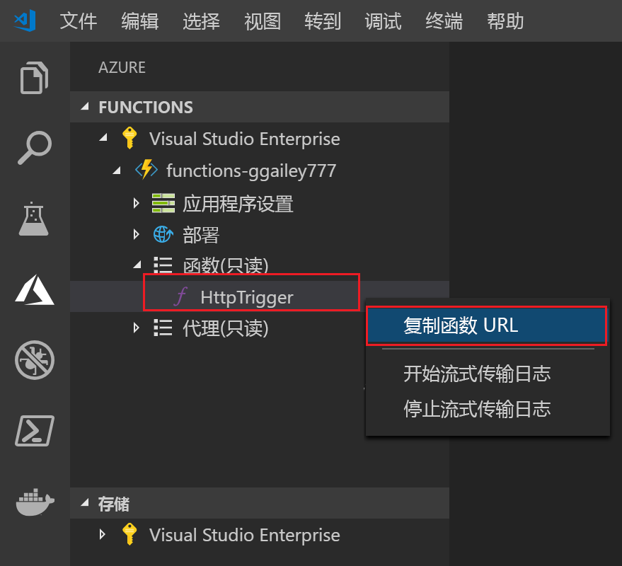

## 将项目发布到 Azure

在本部分，你将在 Azure 订阅中创建一个函数应用和相关资源，然后部署代码。 

1. 在活动栏中选择“Azure”图标，然后在“Azure:  函数”区域中，选择“部署到函数应用...”按钮。 

    

1. 根据提示提供以下信息：

    ::: zone pivot="programming-language-csharp,programming-language-powershell"

    | Prompt | 值 | 说明 |
    | ------ | ----- | ----- |
    | 选择订阅 | 订阅 | 当你有多个订阅时显示。 |
    | 选择 Azure 中的函数应用 | + 创建新的函数应用 | 发布到现有函数应用将覆盖该应用在 Azure 中的内容。 |
    | 输入函数应用的全局唯一名称 | 唯一名称 | 函数应用名称的有效字符包括 `a-z`、`0-9` 和 `-`。 |
    | 选择新资源的位置 | 区域 | 选择你附近的[区域](https://azure.microsoft.com/regions/)。 | 

    ::: zone-end

    ::: zone pivot="programming-language-javascript,programming-language-typescript,programming-language-python"

    | Prompt | 值 | 说明 |
    | ------ | ----- | ----- |
    | 选择订阅 | 订阅 | 当你有多个订阅时显示。 |
    | 选择 Azure 中的函数应用 | + 创建新的函数应用 | 发布到现有函数应用将覆盖该应用在 Azure 中的内容。 |
    | 输入函数应用的全局唯一名称 | 唯一名称 | 函数应用名称的有效字符包括 `a-z`、`0-9` 和 `-`。 |
    | 选择运行时 | 你的版本 | 选择一直在本地运行的语言版本。 |
    | 选择新资源的位置 | 区域 | 选择你附近的[区域](https://azure.microsoft.com/regions/)。 | 

    ::: zone-end

    
1.  完成后，将在订阅中创建以下 Azure 资源：

    + **[资源组](../articles/azure-resource-manager/management/overview.md)** ：包含创建的所有 Azure 资源。 名称基于你的函数应用名称。
    + **[存储帐户](../articles//storage/common/storage-introduction.md#types-of-storage-accounts)** ：将使用基于你的函数应用名称的唯一名称创建一个标准存储帐户。
    + **[托管计划](../articles/azure-functions/functions-scale.md)** ：将在美国西部区域中创建一个消耗计划来托管你的无服务器函数应用。
    + **函数应用**：你的项目将部署到此新的函数应用并在其中运行。
    + **[Application Insights]()** ：连接到函数应用的实例是根据你的函数名称创建的。

    创建函数应用并应用了部署包之后，会显示一个通知。 
    
1. 在此通知中选择“查看输出”  以查看创建和部署结果，其中包括你创建的 Azure 资源。

    

1. 返回到侧栏中的“Azure:  函数”区域，在你的订阅下展开新的函数应用。 展开“函数”，在“HttpExample”中右键单击“(Windows)”或者在按住 Ctrl 的同时单击“(MacOS)”，然后选择“复制函数 URL”。   

    
