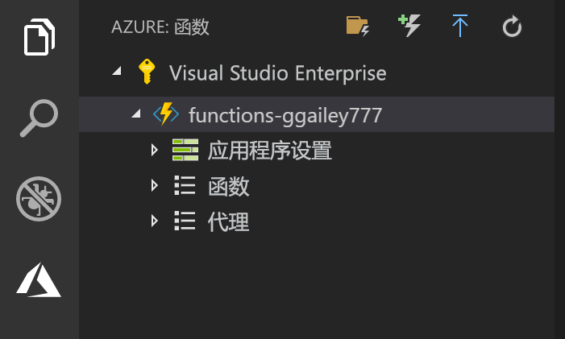

## 将项目发布到 Azure

使用 Visual Studio Code 可以将函数项目直接发布到 Azure。 在此过程中，将在 Azure 订阅中创建函数应用和相关的资源。 函数应用为函数提供了执行上下文。 该项目将打包并部署到 Azure 订阅中的新函数应用。 

本文假定你要创建新的函数应用。 发布到现有函数应用将覆盖该应用在 Azure 中的内容。

1. 在“Azure: Functions”区域中，选择“部署到函数应用”图标。

    

1. 选择项目文件夹（即当前工作区）。

1. 如果有多个订阅，请选择要承载函数应用的订阅，然后选择“+ 创建新的函数应用”。

1. 键入用于标识函数应用的全局唯一名称，然后按 Enter。 函数应用名称的有效字符包括 `a-z`、`0-9` 和 `-`。

1. 选择“+ 创建新的资源组”，键入资源组名称（如 `myResourceGroup`），然后按 Enter。 也可以使用现有资源组。

1. 选择“+ 新建存储帐户”，键入函数应用使用的新存储帐户的全局唯一名称，然后按 Enter。 存储帐户名称必须为 3 到 24 个字符，并且只能包含数字和小写字母。 也可以使用现有帐户。

1. 选择离你近或离函数访问的其他服务近的[区域](https://azure.microsoft.com/regions/)中的位置。

    选择位置后，创建函数应用将会开始。 创建函数应用并应用了部署包之后，会显示一个通知。

1. 在通知中选择“查看输出”以查看创建和部署结果，其中包括你创建的 Azure 资源。

    

1. 记下 Azure 中的新函数应用的 URL。 在该项目发布到 Azure 之后将使用此 URL 来测试函数。

    

1. 回到“Azure: Functions”区域中，你将看到订阅下显示了新的函数应用。 展开此节点时，可以看到函数应用中的函数，以及应用程序设置和函数代理。

    

    从函数应用节点中，按住 Ctrl 并单击（右键单击）可选择要在 Azure 中针对该函数应用执行的各种管理和配置任务。 还可以选择在 Azure 门户中查看该函数应用。
