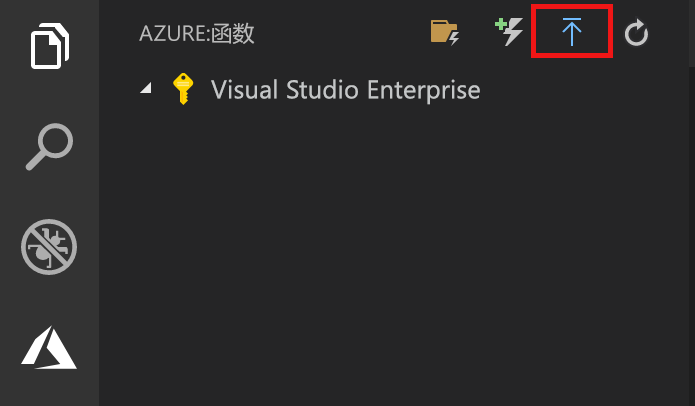
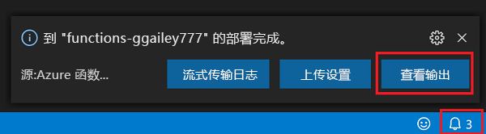

## 将项目发布到 Azure

在本部分，你将在 Azure 订阅中创建一个函数应用和相关资源，然后部署代码。 

1. 在活动栏中选择“Azure”图标，然后在“Azure:  函数”区域中，选择“部署到函数应用...”按钮。 

    

1. 根据提示提供以下信息：

    + **选择订阅**：选择要使用的订阅。 如果只有一个订阅，则不会看到此项。

    + **在 Azure 中选择函数应用**：选择 `+ Create new Function App`（而不是 `Advanced`）。 本文不支持[高级发布流](../articles/azure-functions/functions-develop-vs-code.md#enable-publishing-with-advanced-create-options)。 
    
    >[!IMPORTANT]
    > 发布到现有函数应用将覆盖该应用在 Azure 中的内容。 
    
    + **输入函数应用的全局唯一名称**：键入在 URL 路径中有效的名称。 将对你键入的名称进行验证，以确保其在 Azure Functions 中是唯一的。 
    
    ::: zone pivot="programming-language-python"
    + **选择运行时**：选择你一直在本地运行的 Python 版本。 可以使用 `python --version` 命令来检查你的版本。
    ::: zone-end

    ::: zone pivot="programming-language-javascript,programming-language-typescript"
    + **选择运行时**：选择你一直在本地运行的 Node.js 版本。 可以使用 `node --version` 命令来检查你的版本。
    ::: zone-end

    + **选择新资源的位置**：为了获得更好的性能，请选择你附近的[区域](https://azure.microsoft.com/regions/)。 
    
1.  完成后，将在订阅中创建以下 Azure 资源：

    + **[资源组](../articles/azure-resource-manager/management/overview.md)** ：包含创建的所有 Azure 资源。 名称基于你的函数应用名称。
    + **[存储帐户](../articles//storage/common/storage-introduction.md#types-of-storage-accounts)** ：将使用基于你的函数应用名称的唯一名称创建一个标准存储帐户。
    + **[托管计划](../articles/azure-functions/functions-scale.md)** ：将在美国西部区域中创建一个消耗计划来托管你的无服务器函数应用。
    + **函数应用**：你的项目将部署到此新的函数应用并在其中运行。
    + **Application Insights**：连接到函数应用的实例是根据你的函数名称创建的。

    创建函数应用并应用了部署包之后，会显示一个通知。 
    
1. 在此通知中选择“查看输出”  以查看创建和部署结果，其中包括你创建的 Azure 资源。 如果错过了通知，请选择右下角的响铃图标以再次查看。

    
