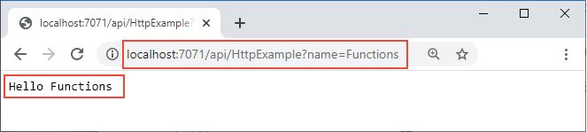

## <a name="run-the-function-locally"></a>在本地运行函数

通过从 LocalFunctionProj  文件夹启动本地 Azure Functions 运行时主机来运行函数：

::: zone pivot="programming-language-csharp,programming-language-powershell,programming-language-javascript,programming-language-python"
```
func start
```
::: zone-end

::: zone pivot="programming-language-typescript"
```
npm install
npm start
```
::: zone-end

在输出的末尾，应显示以下行： 

<pre>
...

Now listening on: http://0.0.0.0:7071
Application started. Press Ctrl+C to shut down.

Http Functions:

        HttpExample: [GET,POST] http://localhost:7071/api/HttpExample
...

</pre>

>[!NOTE]  
> 如果 HttpExample 没有出现（如下所示），则可能是从 HttpExample  文件夹中启动了主机。 在这种情况下，请按 **Ctrl**+**C** 停止主机，导航到父级 LocalFunctionProj  文件夹，然后重新运行上一命令。

将此输出中 `HttpExample` 函数的 URL 复制到浏览器，并追加查询字符串 `?name=<your-name>`，使完整 URL 类似于 `http://localhost:7071/api/HttpExample?name=Functions`。 浏览器应会显示类似于 `Hello Functions` 的消息：



当你发出请求时，运行 `func start` 所在的终端还会显示日志输出。

准备就绪后，按 **Ctrl**+**C** 并选择 `y` 停止函数主机。