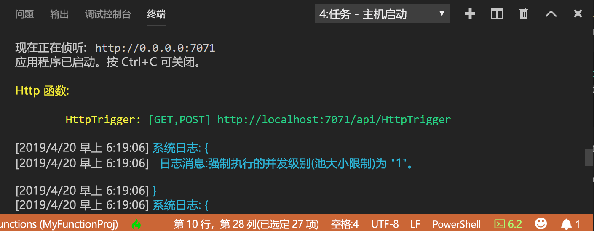
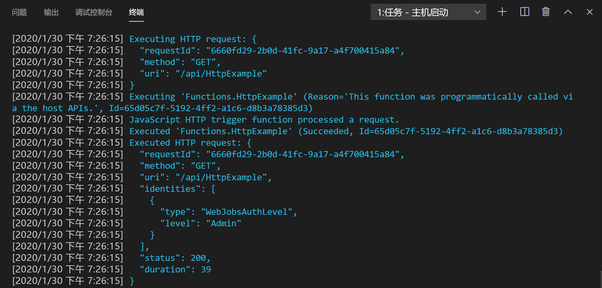

## <a name="run-the-function-locally"></a>在本地运行函数

Azure Functions Core Tools 与 Visual Studio Code 相集成，可让在本地运行和调试 Azure Functions 项目。 有关如何在 Visual Studio Code 中进行调试的详细信息，请参阅[在本地调试 PowerShell Azure Functions](../articles/azure-functions/functions-debug-powershell-local.md)。 

1. 按 F5 启动函数应用项目。 来自 Core Tools 的输出会显示在“终端”  面板中。

1. 在“终端”  面板中，复制 HTTP 触发的函数的 URL 终结点。

    

1. 将查询字符串 `?name=<yourname>` 追加到此 URL，然后在另一个 PowerShell 命令提示符下使用 `Invoke-RestMethod` 执行请求，如下所示：

    ```powershell
    PS > Invoke-RestMethod -Method Get -Uri http://localhost:7071/api/HttpTrigger?name=PowerShell
    Hello PowerShell
    ```

    也可以从浏览器通过以下 URL 执行 GET 请求：

    <http://localhost:7071/api/HttpExample?name=PowerShell>

    调用 HttpTrigger 终结点而未将 `name` 参数作为查询参数或在正文中传递时，该函数将返回 `BadRequest` 错误。 在 run.ps1 中检查代码时，会看到此错误，这是设计使然。

1. 有关请求的信息将显示在“终端”  面板中。

    

1. 完成后，按 **Ctrl + C** 停止 Core Tools。

确认该函数可以在本地计算机上正确运行以后，即可将项目发布到 Azure。