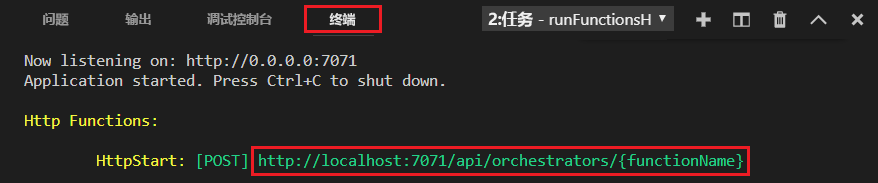
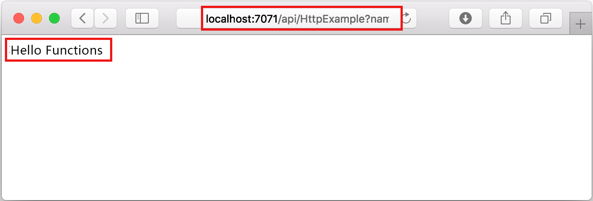
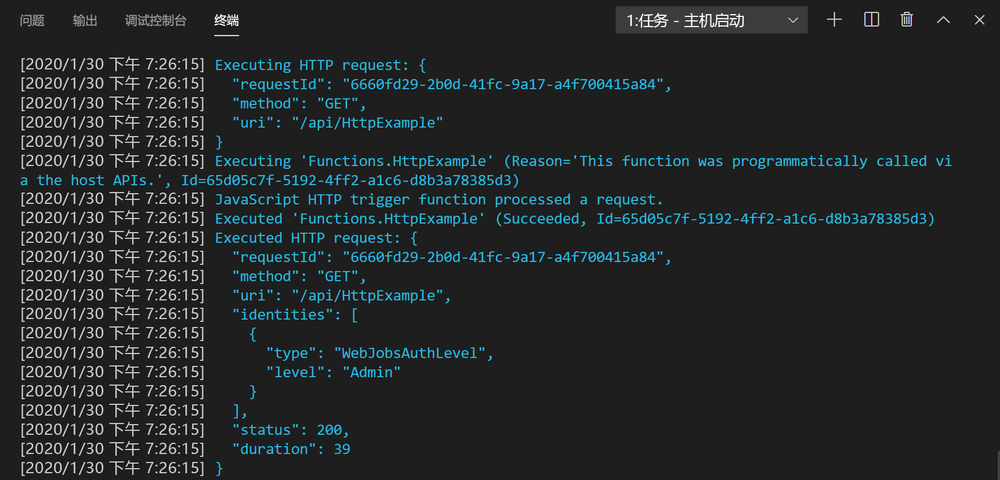

## 在本地运行函数

Visual Studio Code 与 [Azure Functions Core Tools](../articles/azure-functions/functions-run-local.md) 集成，方便你在将内容发布到 Azure 之前在本地开发计算机上运行此项目。

1. 若要调用函数，请按 F5 启动函数应用项目。 来自 Core Tools 的输出会显示在“终端”  面板中。

1. 如果尚未安装 Azure Functions Core Tools，请在提示符下选择“安装”。  安装 Core Tools 后，应用会在“终端”  面板中启动。 可以看到 HTTP 触发函数的 URL 终结点在本地运行。 

    

1. 在 Core Tools 运行时，导航至以下 URL 以执行 GET 请求（其中包括 `?name=Functions` 查询字符串）。

    <http://localhost:7071/api/HttpExample?name=Functions>

1. 系统会返回响应，在浏览器中如下所示：

    

1. 有关请求的信息将显示在“终端”  面板中。

    

1. 按 Ctrl + C 停止 Core Tools 并断开调试器的连接。
